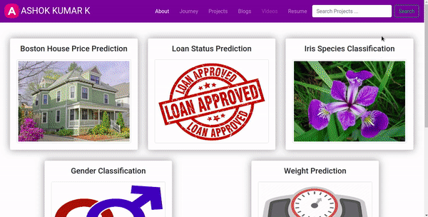
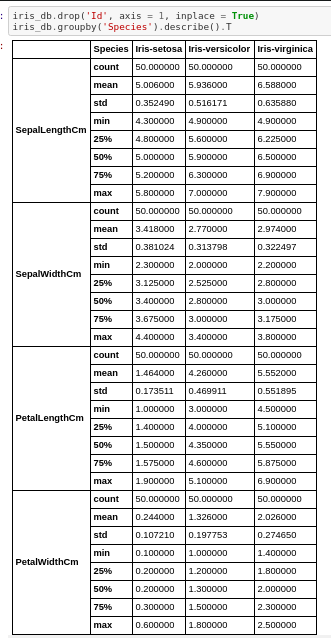
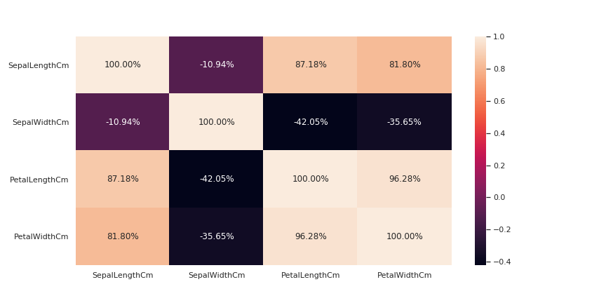
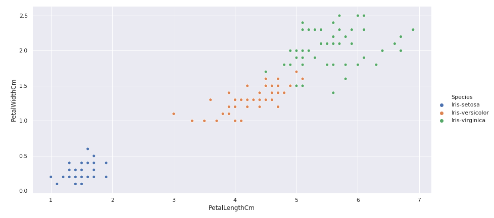
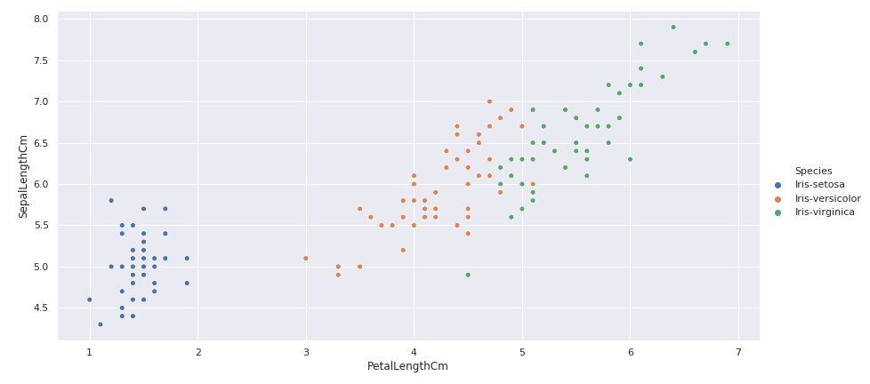
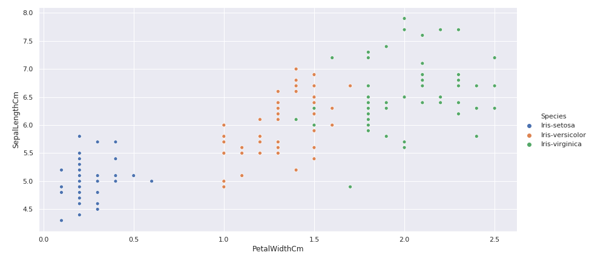
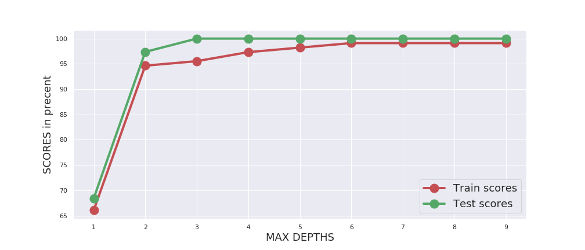
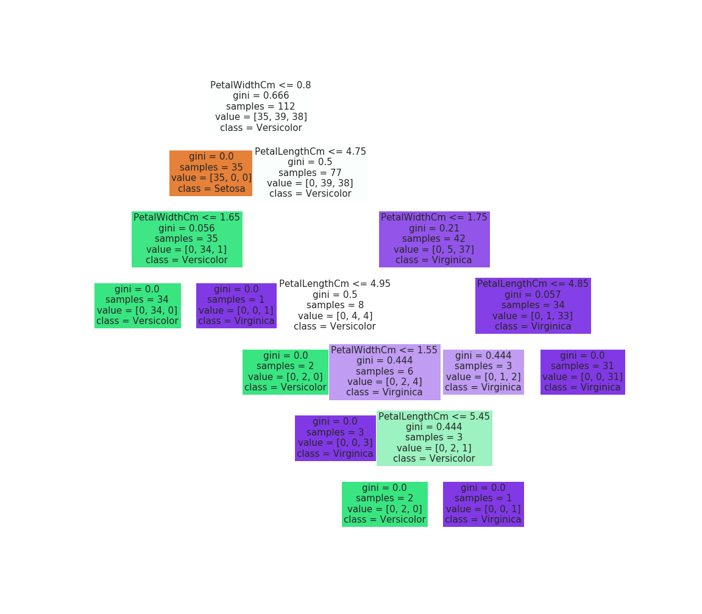
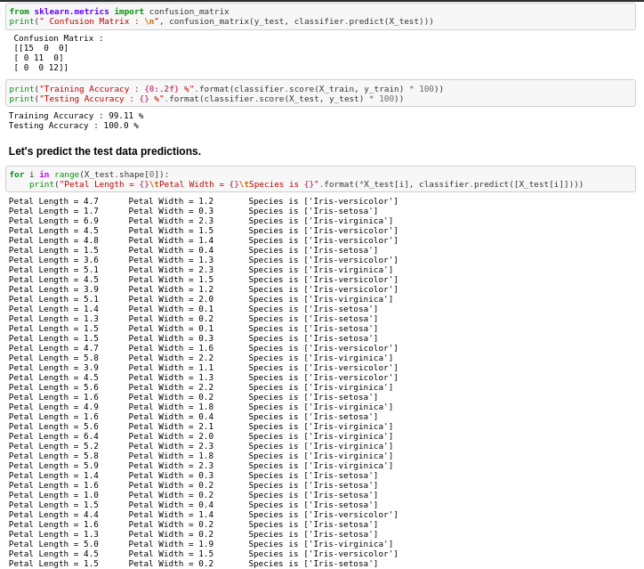

<div align="center"><h1>Iris Species Classification</h1></div>

## Table of Contents

- [Demo](#demo)
- [Introduction](#introduction)
- [Motivation](#motivation)
- [Project Explanation](#project-explanation)
  - [Data Collection](#data-collection)
  - [Data Pre processing](#data-pre-processing)
  - [Exploratory Data Analysis (EDA)](#exploratory-data-analysis-eda)
  - [Feature Observations](#feature-observations)
  - [Feature Selection](#feature-selection)
  - [Building Machine Learning Model](#building-machine-learning-model)
  - [Model Performance](#model-performance)
  - [Build Optimal Model](#build-optimal-model)
  - [Predictions](#predictions)
- [Conclusion](#conclusion)

## Demo

**App Link** - [Iris Species Classifier](https://ashok-machine-learning-project.herokuapp.com/#iris)



## Introduction
The Iris flower data set or Fisher’s Iris data set is a multivariate data set introduced by the British statistician, eugenicist, and biologist Ronald Fisher in his 1936 paper the use of multiple measurements in taxonomic problems as an example of linear discriminant analysis.

## Motivation
This project was started as a motivation for learning Machine Learning Algorithms and to learn the different data preprocessing techniques such as Exploratory Data Analysis, Feature Engineering, Feature Selection, Feature Scaling and finally to build a machine learning model.

## Data Collection
- The dataset is collected from [Kaggle](https://www.kaggle.com/uciml/iris).
- This dataset consists of 3 categories of species which is setosa, versicolor and virginica. 
- We can find two kind of data from kaggle which is CSV data and SQLITE database.
- Each iris species consists of 50 samples.
- The features of iris flower are Sepal Length in cm, Sepal Width in cm, Petal Length in cm and Petal Width in cm.


## Data Pre processing
- We can read the both kind of data by using the below code

```python
# TODO : Load Iris Dataset

# Load Iris csv dataset
iris_csv = pd.read_csv('../data/Iris.csv')

# Load Iris sqlite data
data = sqlite3.connect('../data/database.sqlite')
query = data.execute('SELECT * FROM Iris')
columns = [col[0] for col in query.description]
iris_db = pd.DataFrame.from_records(data = query.fetchall(), columns = columns)
```
<br>

- The data we collect from kaggle is already pre processed. So there is no need of any pre processing.

## Exploratory Data Analysis (EDA)
- Let’s group the data by species and do some descriptive statistics

```python
# Groupby Species for descriptive statistics
iris_db.groupby('Species').describe().T
```

<div align="center"></div>

- **count** shows that there 50 samples for each species.
- **Setosa**
  - Average sepal length is 5cm
  - Average sepal width is 3cm
  - Average petal length is 1.5cm
  - Average petal width is 0.25cm
- **Versicolor**
  - Average sepal length is 6cm
  - Average sepal width is 2.8cm
  - Average petal length is 4.26cm
  - Average petal width is 1.32cm
- **Virginica**
  - Average sepal length is 6.6cm
  - Average sepal width is 3cm
  - Average petal length is 6cm
  - Average petal width is 2cm

- From the above information,
  - Based on Petal length we can easily classify them as *Setosa(1.5cm), Versicolor(4.2cm) and Virginica(6cm)*.
  - Based on Petal width we can easily classify *Setosa(0.25cm) from Versicolor(1.32cm) and Virginica(2cm)*.
  - Sepal width looks similar for all three species — *Setosa(3cm), Versicolor(2.8cm) and Virginica(3cm)*.
  - Based on Sepal length, there are only small changes on three species (5cm, 6cm and 6.6cm)
Since Sepal width looks similar for all the species, we can drop that feature.

## Feature Observations
- Let’s plot the correlation between the features.

```python
# TODO : Correlation between the features
features_correlation = iris_db.drop('Species', axis = 1).corr()

# Let's plot an insightful plot on feature correlation
sb.heatmap(data = features_correlation, annot = True, fmt = '.2%')
```

<div align="center"></div>

#### Let's understand how the Petal length and Petal width contributes together to classify iris species.
```python

# Petal Length vs Petal Width
sb.relplot(x = 'PetalLengthCm', y = 'PetalWidthCm', data = iris_db, hue = 'Species', aspect = 2, height = 6)

```
<div align="center"></div>

- From the above scatter plot, setosa species clearly classified from other two species.
- Other two species can also be classified based on Petal Length and Petal Width easily.

#### Let's understand how the Petal length and Sepal Length contributes together to classify iris species.
```python

# Petal Length vs Sepal Length
sb.relplot(x = 'PetalLengthCm', y = 'SepalLengthCm', data = iris_db, hue = 'Species', aspect = 2, height = 6)

```
<div align="center"></div>

- From the above plot, we can separate versicolor and virginica by means of Petal Length alone.
- Sepal Length does not contribute more here

#### Let's understand how the Petal width and Sepal Length contributes together to classify iris species.
```python

# Petal Width vs Sepal Length
sb.relplot(x = 'PetalWidthCm', y = 'SepalLengthCm', data = iris_db, hue = 'Species', aspect = 2, height = 6)

```
<div align="center"></div>

- From the above plot, we can separate based on Petal Width alone.
- Sepal Length doesn't contribute more here.

## Feature Selection
- From the above discussion, we can easily classify the iris species based on petal features than sepal features.

```python

# Selecting Iris Features
iris_features = iris_db.loc[:, ['PetalLengthCm', 'PetalWidthCm']]
# Selecting Iris Species
iris_species = iris_db.loc[:, 'Species']

```

## Building Machine Learning Model
- Based on above explorations on the data, we came to know that we can classify the iris species based on some conditions on Petal Length and PetalWidth.
- Let's build a **Decision Tree Classifier** model to the data.

```python

# Converting Pandas DataFrames and Series into Numpy arrays
features_values = iris_features.values
species_values = iris_species.values

# TODO : Split the dataset as Train set and Test set.
from sklearn.model_selection import train_test_split
X_train, X_test, y_train, y_test = train_test_split(features_values, species_values, 
                                                    test_size = 0.25, random_state = 42)
                                                    
# TODO : Build Decision Tree Classifier Model
from sklearn.tree import DecisionTreeClassifier
decision_tree_classifier = DecisionTreeClassifier(criterion = 'gini')
decision_tree_classifier.fit(X_train, y_train)

```

## Model Performance
#### Checking model performance by changing max_depth parameter and the criterion as gini

```python
# Initializing Max Depth range
max_depths = list(range(1, 10))
training_scores = []
test_scores = []
for max_depth in max_depths:
    decision_tree_classifier = DecisionTreeClassifier(criterion = 'gini', max_depth = max_depth)
    decision_tree_classifier.fit(X_train, y_train)
    training_scores.append(decision_tree_classifier.score(X_train, y_train)*100)
    test_scores.append(decision_tree_classifier.score(X_test, y_test)*100)
    
plt.figure(figsize = (14, 6))
plt.plot(max_depths, training_scores, 'ro-', linewidth = 4, markersize = 15)
plt.plot(max_depths, test_scores, 'go-', linewidth = 4, markersize = 15)
plt.xlabel('MAX DEPTHS', fontsize = 18)
plt.ylabel('SCORES in precent', fontsize = 18)
plt.legend(labels = ['Train scores', 'Test scores'], fontsize=18)
plt.show()

```

<div align="center"></div>

## Build Optimal Model
- Let's build a optimal model

```python

# Optimal Classifier for Iris Dataset
classifier = DecisionTreeClassifier(max_depth = 6, criterion = 'gini')
classifier.fit(X_train, y_train)

```
- Let's plot the Decision Tree

<div align="center"></div>

## Predictions
Let's see the test data predictions

<div align="center"></div>

## Conclusion

- Finally we finishes the iris classification project.
- We have built a Decision Tree Classifier which performs well with given features petal length and petal width and having the **Training accuracy of 99.11%** and **Testing accuracy of 100%**.

### If you love my work, kindly give a Star to my repository.
### Facing any issues, feel free to post your issues on my GitHub.
### Thank you Everyone for seeing my work.
