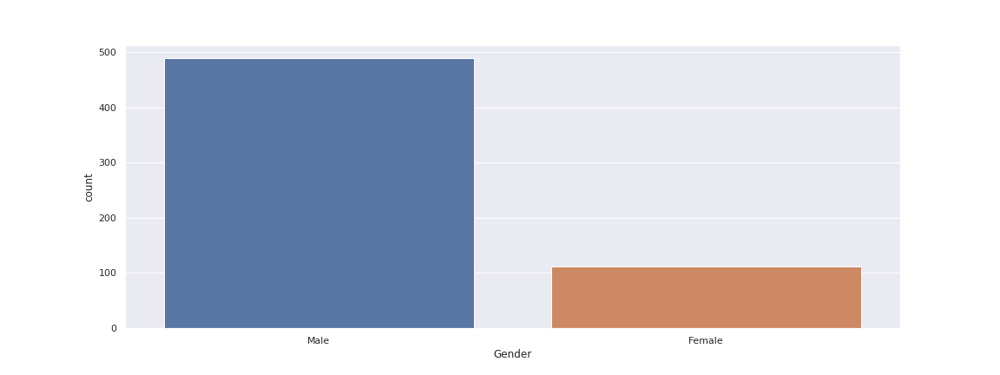

<div align="center"><h1>Loan Status Prediction</h1></div>

# Table of Contents
- Introduction
- Motivation
- Project Explanation
  - Data Collection
  - Feature Engineering
  - Data Pre-processing
  - Exploratory Data Analysis
  - Feature Selection
  - Building Machine Learning Models
  - Model Performance
  - Test data Predictions
- Conclusion


## Introduction
- In this Loan Status Prediction dataset, we have the data of applicants those who previously applied for the loan based on the property which is Property Loan. 
- The bank will decide whether to give a loan for the applicant based on some factors such as Applicant Income, Loan Amount, previous Credit History, Co-applicant Income, etc.., 
- Our goal is to build a Machine Learning Model to predict the loan to be approved or to be rejected for an applicant.
- In this project, we are going to classify an individual whether he/she can get the loan amount based on his/her Income, Education, Working Experience, Loan which is taken previously, and many more factors. 
- Let’s get more into it by looking at the data.

<div align="center"></div>

## Motivation
- This project was started as a motivation for learning Machine Learning Algorithms and to learn the different data preprocessing techniques such as Exploratory Data Analysis, Feature Engineering, Feature Selection, Feature Scaling and finally to build a machine learning model.
- In this project, I have implemented various data pre-processing tecniques such as imputing null values, encoding categorical columns and handled the imbalanced data.

## Project Explanation
### 1. Data Collection
- The dataset is collected from [Kaggle](https://www.kaggle.com/altruistdelhite04/loan-prediction-problem-dataset).
- The dataset which we get from kaggle consists of two CSV(Comma Separated Values) files.
  - One is Train Data (`train_u6lujuX_CVtuZ9i.csv`)
  - Another is Test Data (`test_Y3wMUE5_7gLdaTN.csv`)

**Loading the collected data**

- The CSV data is loaded with the help of [read_csv](https://pandas.pydata.org/pandas-docs/stable/reference/api/pandas.read_csv.html) method in pandas library.
```python
# TODO : To Load previous applicants loan application data
loan_train = pd.read_csv('../data/train_u6lujuX_CVtuZ9i.csv')
```
- The Training data consists of 614 applicant samples and 12 features.
- The 12 features are Loan_ID, Gender, Married, Dependents, Education, Self_Employed, ApplicanIncome, CoapplicantIncome, LoanAmount, Loan_Amount_Term, Credit_History and Property Area.

### 2. Feature Engineering
There are 12 features in the training data. Let's explore the features.

***Loan_ID***

- The Loan_ID is generally is used to identify an applicant uniquely but in any way, it doesn’t decide the loan status. So we can ignore the Loan_ID column for the prediction.

***Gender***

- Gender is a **nominal** kind of **qualitative** data, because there is no numerical relation between different genders.
- For 13 applicants, gender is not mentioned in the data.
- The Unique values are Male and Female
- There are 489 Male and 112 Female applicants



- By extracting the samples having null values on Gender columns separately, I am able to get the folowing details :
  - Most of these people are married. So we can't fill Gender based on Married column.
  - Most of these people are graduated. So we can't fill Gender based on Education column.
  - Most of these people are self employed. So we can't fill Gender based on Self_Employed column.
  - Most of these people are having Credit_History and Loan_Amount_Term as 360 days(1 year).
  - Since we are going to predict applicant's Gender, we can omit CoapplicantIncome
  - So we are going predict the Gender based on Dependents, ApplicantIncome, LoanAmount, and Property_Area
 - Since we are going to use scikit-learn library and it is mostly deal with numerical data, we have to encode this categorical column to Numerical column.

***Married***

***Dependents***

***Education***

***Self_Employed***

***Applicant_Income***

***Co-applicant_Income***

***Loan_Amount***

***Loan_Amount_Term***

***Credit_History***

***Property_Area***
