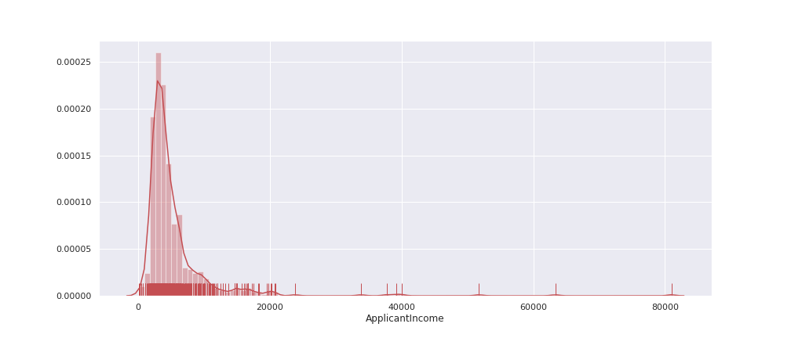
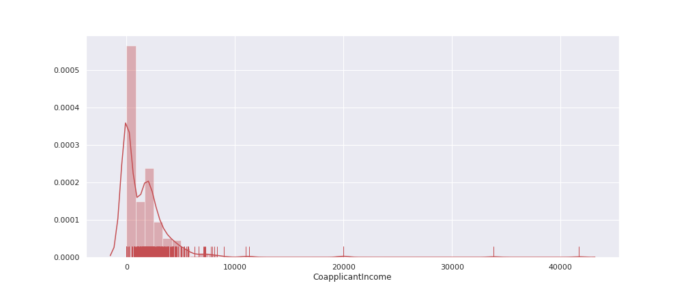
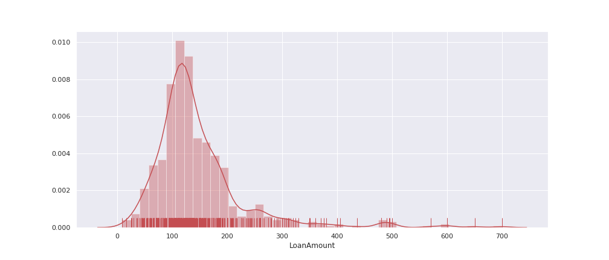
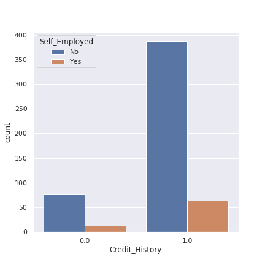

<h1 align="center">Loan Status Prediction</h1>

# Table of Contents
- Introduction
- Motivation
- Project Explanation
  - Data Collection
  - Feature Engineering
  - Data Pre-processing
  - Exploratory Data Analysis
  - Feature Selection
  - Building Machine Learning Models
  - Model Performance
  - Test data Predictions
- Conclusion


## Introduction
- In this Loan Status Prediction dataset, we have the data of applicants those who previously applied for the loan based on the property which is Property Loan. 
- The bank will decide whether to give a loan for the applicant based on some factors such as Applicant Income, Loan Amount, previous Credit History, Co-applicant Income, etc.., 
- Our goal is to build a Machine Learning Model to predict the loan to be approved or to be rejected for an applicant.
- In this project, we are going to classify an individual whether he/she can get the loan amount based on his/her Income, Education, Working Experience, Loan which is taken previously, and many more factors. 
- Let’s get more into it by looking at the data.

<div align="center"></div>

## Motivation
- This project was started as a motivation for learning Machine Learning Algorithms and to learn the different data preprocessing techniques such as Exploratory Data Analysis, Feature Engineering, Feature Selection, Feature Scaling and finally to build a machine learning model.
- In this project, I have implemented various data pre-processing tecniques such as imputing null values, encoding categorical columns and handled the imbalanced data.

## Project Explanation
### 1. Data Collection
- The dataset is collected from [Kaggle](https://www.kaggle.com/altruistdelhite04/loan-prediction-problem-dataset).
- The dataset which we get from kaggle consists of two CSV(Comma Separated Values) files.
  - One is Train Data (`train_u6lujuX_CVtuZ9i.csv`)
  - Another is Test Data (`test_Y3wMUE5_7gLdaTN.csv`)

**Loading the collected data**

- The CSV data is loaded with the help of [read_csv](https://pandas.pydata.org/pandas-docs/stable/reference/api/pandas.read_csv.html) method in pandas library.
```python
# TODO : To Load previous applicants loan application data
loan_train = pd.read_csv('../data/train_u6lujuX_CVtuZ9i.csv')
```
- The Training data consists of 614 applicant samples and 12 features.
- The 12 features are Loan_ID, Gender, Married, Dependents, Education, Self_Employed, ApplicanIncome, CoapplicantIncome, LoanAmount, Loan_Amount_Term, Credit_History and Property Area.

### 2. Feature Engineering
There are 12 features in the training data. Let's explore the features.

***Loan_ID***

- The Loan_ID is generally is used to identify an applicant uniquely but in any way, it doesn’t decide the loan status. So we can ignore the Loan_ID column for the prediction.

***Gender***

- Gender is a **nominal** kind of **qualitative** data, because there is no numerical relation between different genders.
- For 13 applicants, Gender is not mentioned in the data.
- The Unique values are Male and Female
- There are 489 Male and 112 Female applicants

<div align="center"></div>

- By extracting the samples having null values on Gender columns separately, I am able to get the folowing details :
  - Most of these people are married. So we can't fill Gender based on Married column.
  - Most of these people are graduated. So we can't fill Gender based on Education column.
  - Most of these people are self employed. So we can't fill Gender based on Self_Employed column.
  - Most of these people are having Credit_History and Loan_Amount_Term as 360 days(1 year).
  - Since we are going to predict applicant's Gender, we can omit CoapplicantIncome
  - So we are going predict the Gender based on Dependents, ApplicantIncome, LoanAmount, and Property_Area
- Since we are going to use scikit-learn library and it is mostly deal with numerical data, we have to encode this categorical column to Numerical column.

<div align="center"></div>


***Married***

- Since there are only 2 kind of values are possible to be present in this feature which is married or not married. This is a **binary** kind of **qualitative** data.
- For 3 applicants, Married is not mentioned in the data.
- The two unique values present in the feature is `Yes` and `No`.

<div align="center"></div>

- By extracting the samples having null values on Married columns separately, I am able to get the folowing details :
  - Those 3 applicants are Graduated, Not Self_Employed, and having Credit History.
  - Applied for different Loan_Amount_Term - 360, 240 and 480
  - The property area is Semiurban for 2 applicants and Urban for 1 applicant.
  - Loan is approved for all 3 applicants.
- Since we are going to use scikit-learn library and it is mostly deal with numerical data, we have to encode this categorical column to Numerical column with binary values 1 and 0. 1 is for Married and 0 is for Not married applicant

<div align="center"></div>

***Dependents***

- The Dependents feature is a **discrete** kind of **quantitative** data.
- From my thought, dependents feature refer to the number of children of applicant.
- For 15 applicants, Dependents is not mentioned in the data.
- There are 4 unique values present in this feature. They are `0`, `1`, `2`, and `3+`.

<div align="center"></div>

- By extracting the samples having null values on Dependents columns separately, I am able to get the folowing details :
  - Most of them are Married, Male applicants, Graduated and Not Self_Employed.
  - Since the data is in the form of string, we should convert it into integer values.
  - In this generation, 3+ children is very less. So we can convert `3+` into `3`.

<div align="center"></div>

***Education***

- The Education column is a **binary** kind of **qualitative** data. Because there are only two values possible in this feature. They are Graduated and Not Graduated.
- All the applicants given their Education Details
- The two binary values are `Graduate` and `Not Graduate`.

<div align="center"></div>

- Most of the applicants are graduated.
- It is a binary data, we can encode the null value with 0 for Not Graduated and 1 for Graduated

<div align="center"></div>


***Self_Employed***

- The Self_Employed column is a **binary** kind of **qualitative** data. Because there are only two values possible in this feature. They are Self_Employed and Not Self_Employed.
- For 32 applicants, Self_Employed status is not mentioned in the data
- The two binary values are `Yes` and `No`.

<div align="center"></div>

- Nearly 86% percentage of the applicant are not self employed.
- Since it is a binary data, we can encode the column with binary values. 1 for Self_Employed and 0 for Not Self_Employed.

<div align="center"></div>

***Applicant_Income***

- The Applicant Income column is a **continuous** kind of quantitative data.
- All the applicants provided their Applicant Income.

Let's see the distribution of Applicant Income

<div align="center"></div>

- From the above distplot, most of the Applicants income less than Rs.10,000 and some considerable amount of applicants having income between Rs.10,000 and Rs.20,000.

***Co-applicant_Income***

- The Co-applicant Income column is a **continuous** kind of **quantitative** data.
- All the applicants provided their Co-applicant Income.

Let's see the distribution of Co-applicant Income

<div align="center"></div>

From the above dist plot most of the co-applicant income is zero or nearer to zero

***Loan_Amount***

- The Co-applicant Income column is a **continuous** kind of **quantitative** data.
- For 22 applicants, the LoanAmount are not mentioned in the data.

Let's see the distribution of Loan Amount

<div align="center"></div>


***Loan_Amount_Term***

- The Loan_Amount_Term column is a **discrete** kind of **quantitative** data.
- For 14 applicants, the Loan_Amount_Term is not included in the data.
- The different Loan_Amount_Terms are 12, 3, 60, 84, 120, 180, 240, 300, 360 and 480.

<div align="center"></div>

- From the above plot, we can see that the Loan_Amount_Term of 360 is most frequently chosen. 
- Nearly 83 % of applicants choose to 360 Term.

***Credit_History***

- It is a **binary** kind of **qualitative** data.
- For 50 applicants, the Credit_History are not mentioned in the data.
- It consists of binary values.
  - For applicants having Credit_History - 1
  - For applicants aving Credit_History - 0

<div align="center"></div>

***Property_Area***

- The Property_Area column is a **ordinal** kind of **qualitative** data.
- All the applicants given their Property_Area.
- The ordinal datas present in this column are Urban, Semiurban and Rural.

<div align="center"></div>

### 3. Data PreProcessing
