<h1 align="center">Loan Status Prediction</h1>

# Table of Contents
- [Demo](#demo)
- [Introduction](#introduction)
- [Motivation](#motivation)
- [Project Explanation](#project-explanation)
  - [Data Collection](#data-collection)
  - [Feature Engineering](#feature-engineering)
  - [Data Pre processing](#data-pre-processing)
  - [Feature Selection](#feature-selection)
  - [Building Machine Learning Models](#building-machine-learning-models)
  - [Model Performance](#model-performance)
  - [Building Optimum Model](#building-optimum-model)
  - [Test data Predictions](#test-data-predictions)
- [Conclusion](#conclusion)

## Demo
**App Link** - [Loan Status Predictor](https://ashok-machine-learning-project.herokuapp.com/#loan)

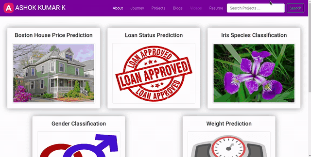

## Introduction
- In this Loan Status Prediction dataset, we have the data of applicants those who previously applied for the loan based on the property which is Property Loan. 
- The bank will decide whether to give a loan for the applicant based on some factors such as Applicant Income, Loan Amount, previous Credit History, Co-applicant Income, etc.., 
- Our goal is to build a Machine Learning Model to predict the loan to be approved or to be rejected for an applicant.
- In this project, we are going to classify an individual whether he/she can get the loan amount based on his/her Income, Education, Working Experience, Loan which is taken previously, and many more factors. 
- Let’s get more into it by looking at the data.

<div align="center"></div>

## Motivation
- This project was started as a motivation for learning Machine Learning Algorithms and to learn the different data preprocessing techniques such as Exploratory Data Analysis, Feature Engineering, Feature Selection, Feature Scaling and finally to build a machine learning model.
- In this project, I have implemented various data pre-processing tecniques such as imputing null values, encoding categorical columns and handled the imbalanced data.

## Project Explanation
### Data Collection
- The dataset is collected from [Kaggle](https://www.kaggle.com/altruistdelhite04/loan-prediction-problem-dataset).
- The dataset which we get from kaggle consists of two CSV(Comma Separated Values) files.
  - One is Train Data (`train_u6lujuX_CVtuZ9i.csv`)
  - Another is Test Data (`test_Y3wMUE5_7gLdaTN.csv`)

**Loading the collected data**

- The CSV data is loaded with the help of [read_csv](https://pandas.pydata.org/pandas-docs/stable/reference/api/pandas.read_csv.html) method in pandas library.
```python
# TODO : To Load previous applicants loan application data
loan_train = pd.read_csv('../data/train_u6lujuX_CVtuZ9i.csv')
```
- The Training data consists of 614 applicant samples and 12 features.
- The 12 features are Loan_ID, Gender, Married, Dependents, Education, Self_Employed, ApplicanIncome, CoapplicantIncome, LoanAmount, Loan_Amount_Term, Credit_History and Property Area.

### Feature Engineering
There are 12 features in the training data. Let's explore the features.

***Loan_ID***

- The Loan_ID is generally is used to identify an applicant uniquely but in any way, it doesn’t decide the loan status. So we can ignore the Loan_ID column for the prediction.

***Gender***

- Gender is a **nominal** kind of **qualitative** data, because there is no numerical relation between different genders.
- For 13 applicants, Gender is not mentioned in the data.
- The Unique values are Male and Female
- There are 489 Male and 112 Female applicants

<div align="center">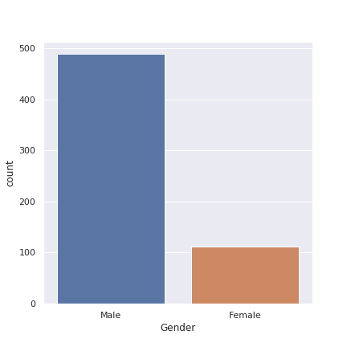</div>

- By extracting the samples having null values on Gender columns separately, I am able to get the folowing details :
  - Most of these people are married. So we can't fill Gender based on Married column.
  - Most of these people are graduated. So we can't fill Gender based on Education column.
  - Most of these people are self employed. So we can't fill Gender based on Self_Employed column.
  - Most of these people are having Credit_History and Loan_Amount_Term as 360 days(1 year).
  - Since we are going to predict applicant's Gender, we can omit CoapplicantIncome
  - So we are going predict the Gender based on Dependents, ApplicantIncome, LoanAmount, and Property_Area
- Since we are going to use scikit-learn library and it is mostly deal with numerical data, we have to encode this categorical column to Numerical column.

<div align="center">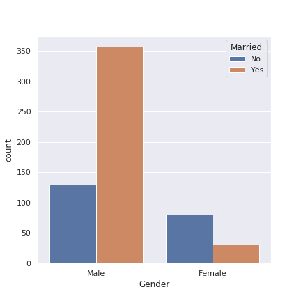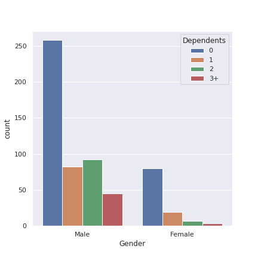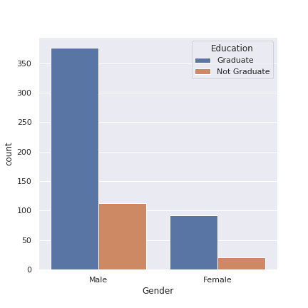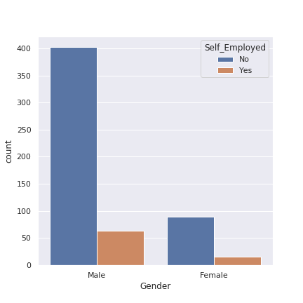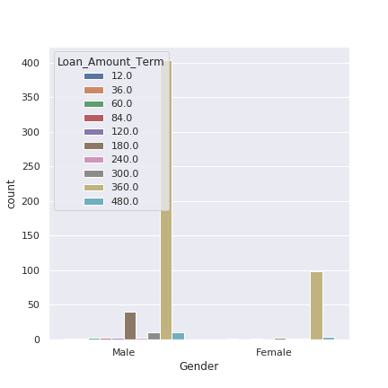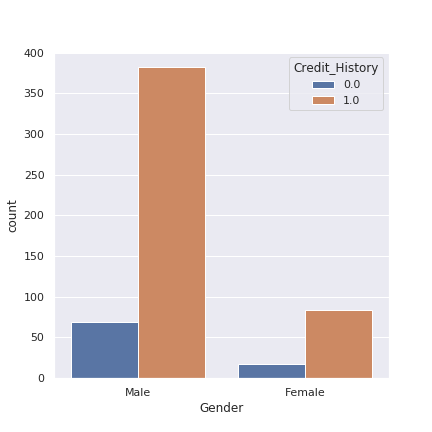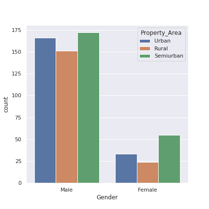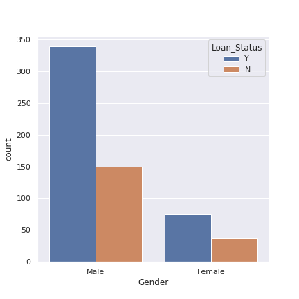</div>


***Married***

- Since there are only 2 kind of values are possible to be present in this feature which is married or not married. This is a **binary** kind of **qualitative** data.
- For 3 applicants, Married is not mentioned in the data.
- The two unique values present in the feature is `Yes` and `No`.

<div align="center">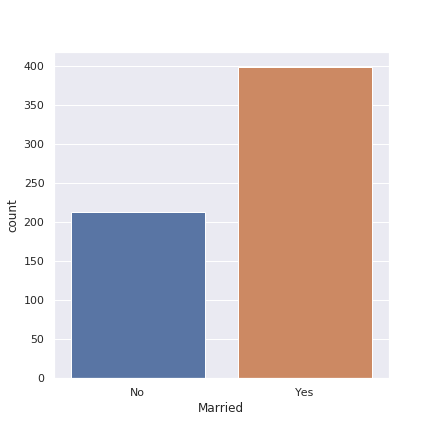</div>

- By extracting the samples having null values on Married columns separately, I am able to get the folowing details :
  - Those 3 applicants are Graduated, Not Self_Employed, and having Credit History.
  - Applied for different Loan_Amount_Term - 360, 240 and 480
  - The property area is Semiurban for 2 applicants and Urban for 1 applicant.
  - Loan is approved for all 3 applicants.
- Since we are going to use scikit-learn library and it is mostly deal with numerical data, we have to encode this categorical column to Numerical column with binary values 1 and 0. 1 is for Married and 0 is for Not married applicant

<div align="center">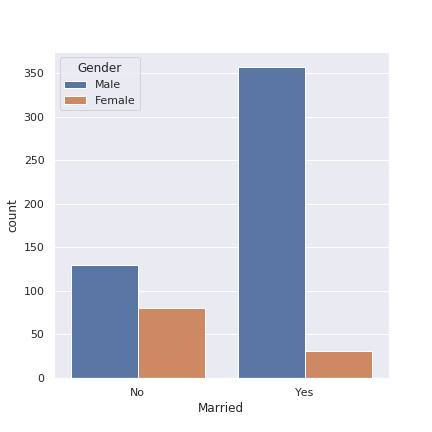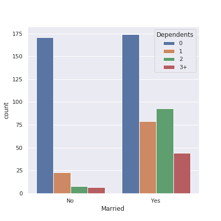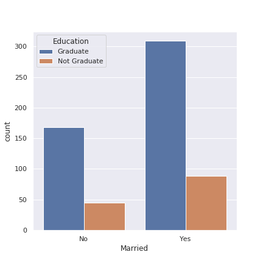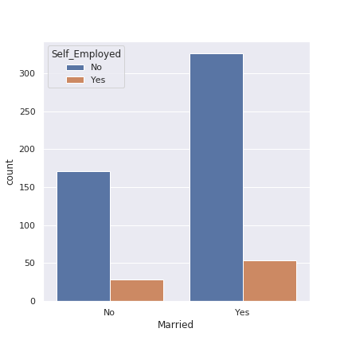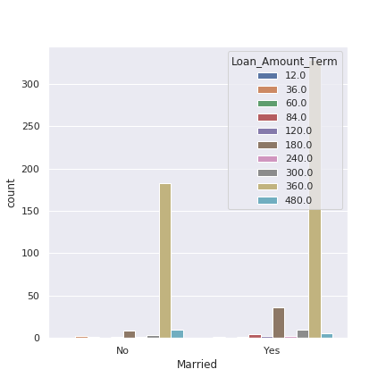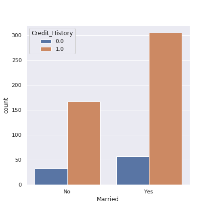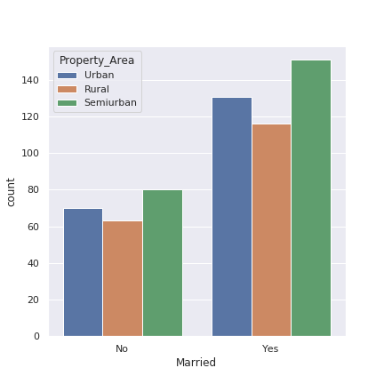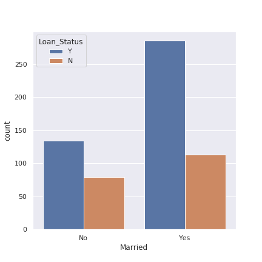</div>

***Dependents***

- The Dependents feature is a **discrete** kind of **quantitative** data.
- From my thought, dependents feature refer to the number of children of applicant.
- For 15 applicants, Dependents is not mentioned in the data.
- There are 4 unique values present in this feature. They are `0`, `1`, `2`, and `3+`.

<div align="center">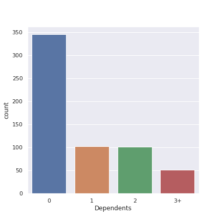</div>

- By extracting the samples having null values on Dependents columns separately, I am able to get the folowing details :
  - Most of them are Married, Male applicants, Graduated and Not Self_Employed.
  - Since the data is in the form of string, we should convert it into integer values.
  - In this generation, 3+ children is very less. So we can convert `3+` into `3`.

<div align="center">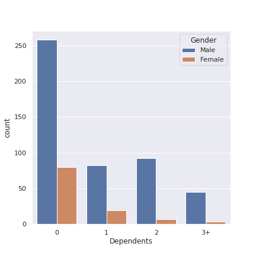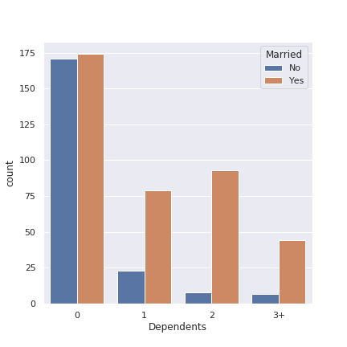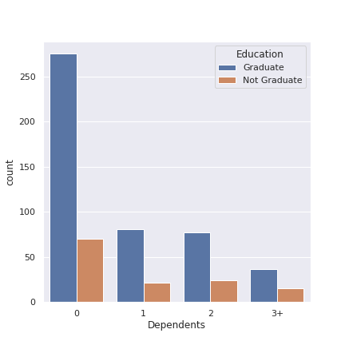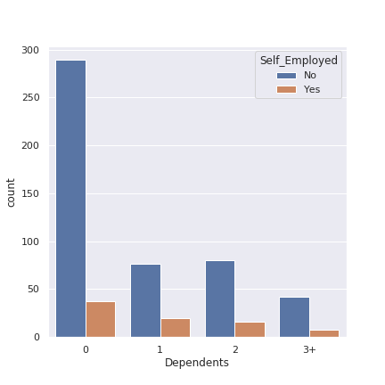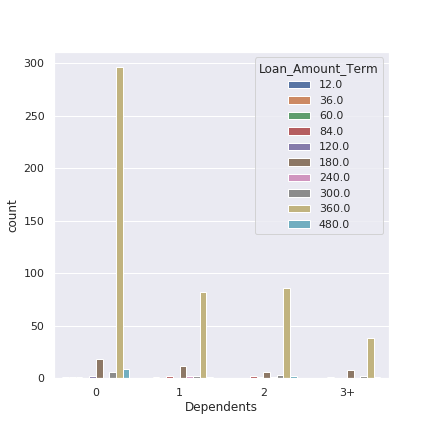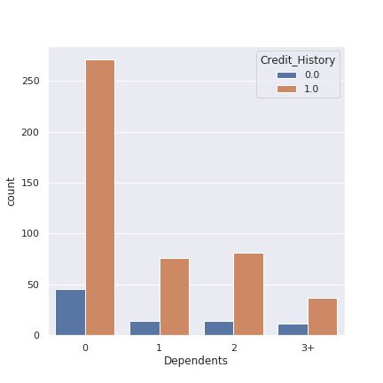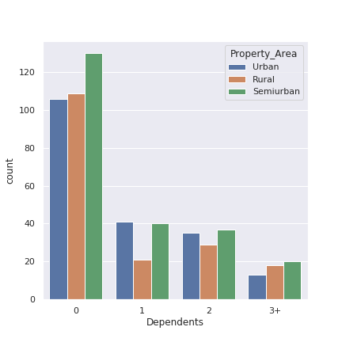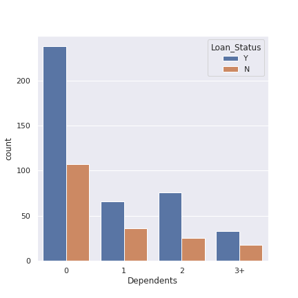</div>

***Education***

- The Education column is a **binary** kind of **qualitative** data. Because there are only two values possible in this feature. They are Graduated and Not Graduated.
- All the applicants given their Education Details
- The two binary values are `Graduate` and `Not Graduate`.

<div align="center">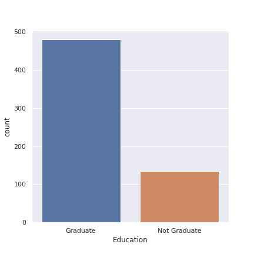</div>

- Most of the applicants are graduated.
- It is a binary data, we can encode the null value with 0 for Not Graduated and 1 for Graduated

<div align="center">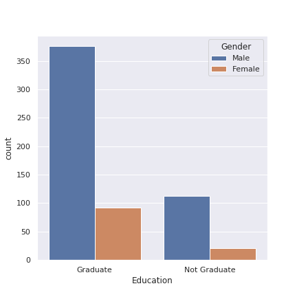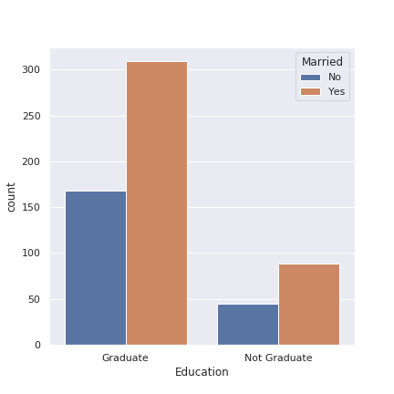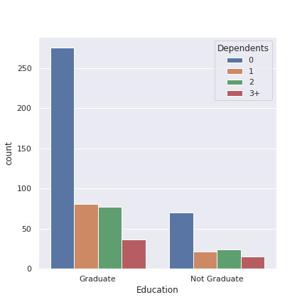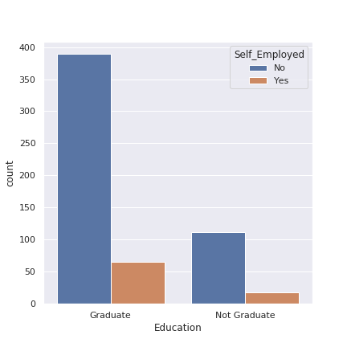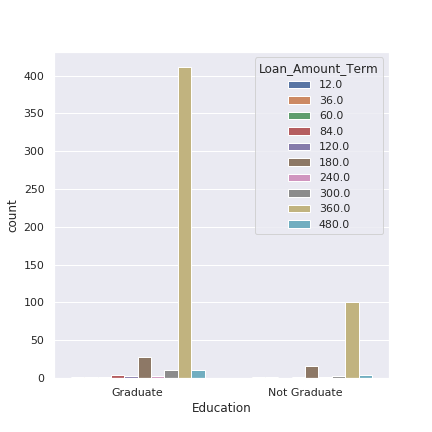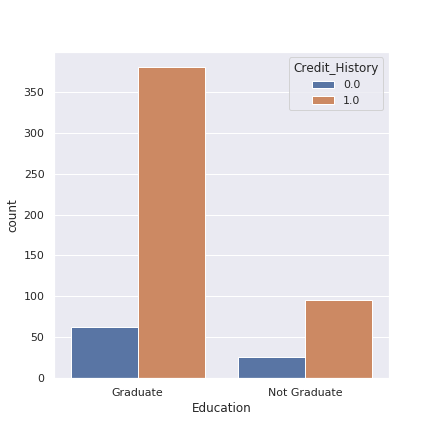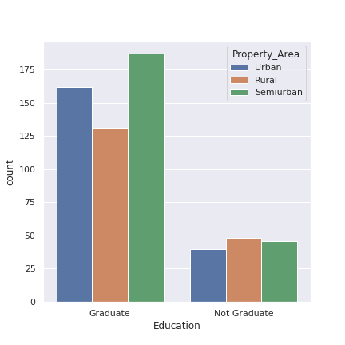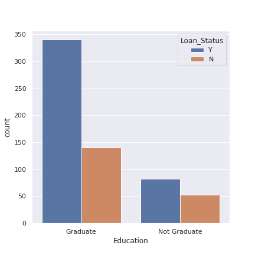</div>


***Self_Employed***

- The Self_Employed column is a **binary** kind of **qualitative** data. Because there are only two values possible in this feature. They are Self_Employed and Not Self_Employed.
- For 32 applicants, Self_Employed status is not mentioned in the data
- The two binary values are `Yes` and `No`.

<div align="center">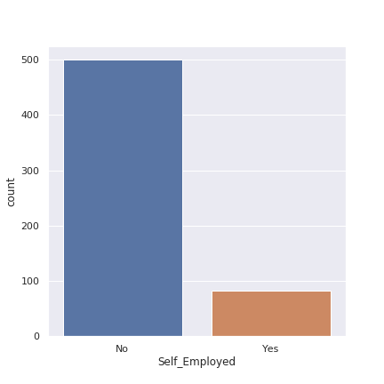</div>

- Nearly 86% percentage of the applicant are not self employed.
- Since it is a binary data, we can encode the column with binary values. 1 for Self_Employed and 0 for Not Self_Employed.

<div align="center">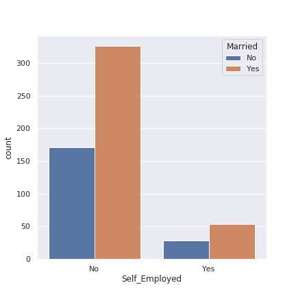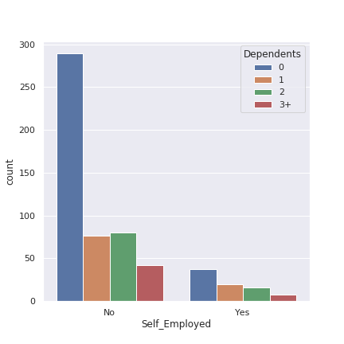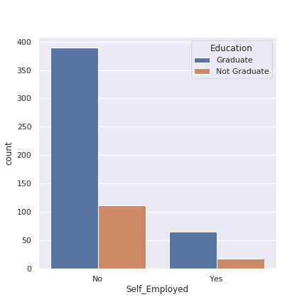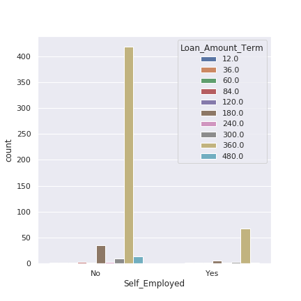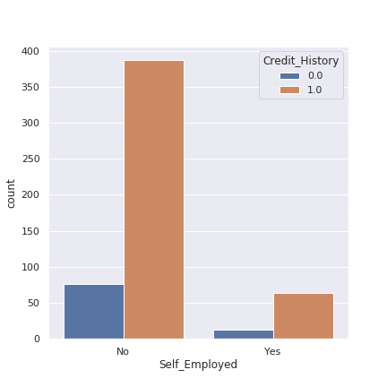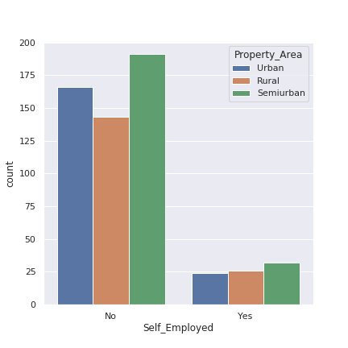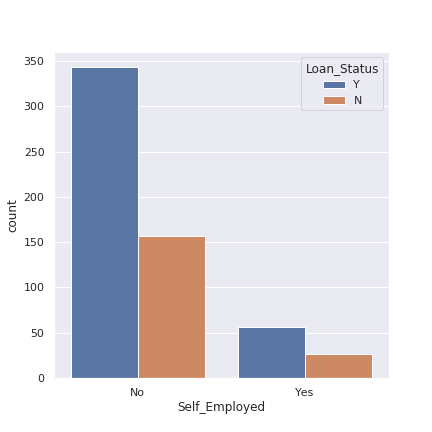</div>

***Applicant_Income***

- The Applicant Income column is a **continuous** kind of quantitative data.
- All the applicants provided their Applicant Income.

Let's see the distribution of Applicant Income

<div align="center">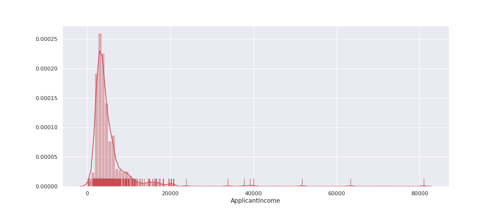</div>

- From the above distplot, most of the Applicants income less than Rs.10,000 and some considerable amount of applicants having income between Rs.10,000 and Rs.20,000.

***Co-applicant_Income***

- The Co-applicant Income column is a **continuous** kind of **quantitative** data.
- All the applicants provided their Co-applicant Income.

Let's see the distribution of Co-applicant Income

<div align="center"></div>

From the above dist plot most of the co-applicant income is zero or nearer to zero

***Loan_Amount***

- The Co-applicant Income column is a **continuous** kind of **quantitative** data.
- For 22 applicants, the LoanAmount are not mentioned in the data.

Let's see the distribution of Loan Amount

<div align="center">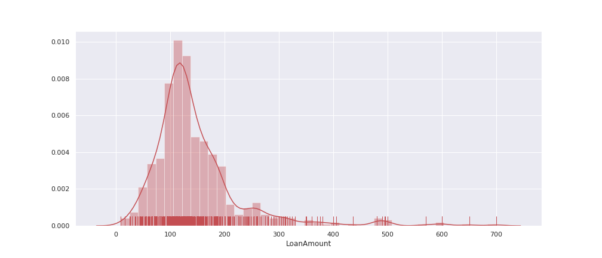</div>


***Loan_Amount_Term***

- The Loan_Amount_Term column is a **discrete** kind of **quantitative** data.
- For 14 applicants, the Loan_Amount_Term is not included in the data.
- The different Loan_Amount_Terms are 12, 3, 60, 84, 120, 180, 240, 300, 360 and 480.

<div align="center">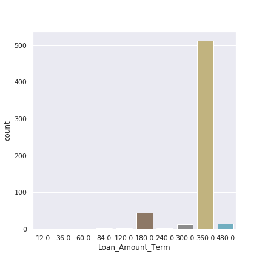</div>

- From the above plot, we can see that the Loan_Amount_Term of 360 is most frequently chosen. 
- Nearly 83 % of applicants choose to 360 Term.

***Credit_History***

- It is a **binary** kind of **qualitative** data.
- For 50 applicants, the Credit_History are not mentioned in the data.
- It consists of binary values.
  - For applicants having Credit_History - 1
  - For applicants aving Credit_History - 0

<div align="center">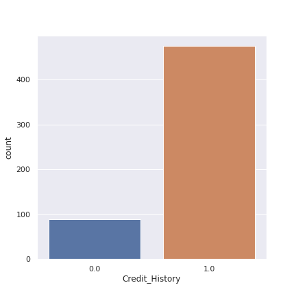</div>

From the above plot, the point we got is
- If the applicant is having Credit_History, then there is a difficulty on classifying.
- But if the applicant is not having Credit_History, then there is a high probability chance of rejection.

<div align="center">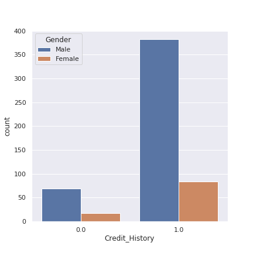</div>

***Property_Area***

- The Property_Area column is a **ordinal** kind of **qualitative** data.
- All the applicants given their Property_Area.
- The ordinal datas present in this column are Urban, Semiurban and Rural.

<div align="center"></div>

<h5 align="center">Hence we finished our Feature Engineering part</h5>

### Data Pre-processing

Let's implement the data preprocessing techniques such as imputing null values, encoding categorical data, etc..,

***Gender***

From the feature engineering, we found that there is a relation between Gender and some other features present in the data. so we are going to fill the null data in gender column by predicting. For prediction, here I used KNearestNeighbors algorithm and we can also use KNNImputer.

```python
# Initialize Gender predictor columns list
GENDER_PREDICTOR_COLUMNS = ['Dependents', 'ApplicantIncome', 'LoanAmount', 'Property_Area', 'Gender']

# Let's get the rows not having null values on gender column
samples_without_null_values_on_gender_column = loan_train[~loan_train['Gender'].isnull()][GENDER_PREDICTOR_COLUMNS]
print("Number of Samples Before dropping samples having null values in predictor columns for Gender column: ", 
     samples_without_null_values_on_gender_column.shape[0])

# Dropping samples having null values in predictor columns
samples_without_null_values_on_gender_column = samples_without_null_values_on_gender_column.dropna(how = 'any')
print("Number of Samples After dropping samples having null values in predictor columns for Gender column: ", 
     samples_without_null_values_on_gender_column.shape[0])

# Conveting categorical values on Dependents column to numerical values
samples_without_null_values_on_gender_column['Dependents'] = samples_without_null_values_on_gender_column['Dependents'].apply(
    lambda x : {'0': 0, '1':1, '2':2, '3+':3}[x]
)
# Conveting categorical values on Property_Area column to numerical values
samples_without_null_values_on_gender_column['Property_Area'] = samples_without_null_values_on_gender_column['Property_Area'].apply(
    lambda x : {'Urban': 2, 'Semiurban':1.5, 'Rural':1}[x]
)

# Building Gender Predictor using Pipeline and KNeigborsClassifiers
Gender_predictor = Pipeline(steps = [
    ('scaler', StandardScaler()),
    ('gen_predictor', KNeighborsClassifier(n_neighbors = 1))
])
Gender_predictor.fit(samples_without_null_values_on_gender_column.iloc[:, :-1].values,
                    samples_without_null_values_on_gender_column.iloc[:, -1].values)

# Function which fills null values on Gender column
def gender_null_value_filler(df, Gender_predictor):
    for row in range(df.shape[0]):
        if df.loc[row, 'Gender'] is np.nan:
            X = loan_train.loc[row, GENDER_PREDICTOR_COLUMNS[:-1]].values.reshape(1, -1)
            X[0][0] = {'0': 0, '1':1, '2':2, '3+':3}[X[0][0]]
            X[0][3] = {'Urban': 2, 'Semiurban':1.5, 'Rural':1}[X[0][3]]
            df.loc[row, 'Gender'] = Gender_predictor.predict(X)
    return df
    
# TODO : Filling null values on Gender columns optimally
loan_train = gender_null_value_filler(loan_train, Gender_predictor)
```
Hence we filled the null values on gender column. Since it is a categorical column, we have to encode it to numerical values. I encoded Male as 1 and Female as 0 by simply using a lambda function.

```python
# TODO : Encoding Gender Column - Male : 1, Female : 0
loan_train['Gender'] = loan_train.Gender.apply(lambda x : {'Male': 1, 'Female' : 0}[x])
```

***Married***

From feature engineering, we get that most of applicants are married. So we are going to fill the null value with `Yes`.
```python
# Let's fill null values in Married columns with 'Yes'
loan_train['Married'] = loan_train['Married'].fillna('Yes')
```
Since it is a categorical column, we have to encode this to numerical value. I encoded Yes as 1 and No as 0 by simply using a lambda function.
```python
# TODO : encoding categorical values into numerical values
loan_train['Married'] = loan_train['Married'].apply(lambda x : {'Yes' : 1, 'No' : 0}[x])
```

***Dependents***

From feature engineering, we found that there are 15 null values. The applicants who didn't married will not be having dependents. So for the applicants those who are not married we can fill Dependents as 0 and for married dependents as 1.

```python
# TODO : Function for filling null values on dependents columns
def dependents_null_value_filler(df):
    for row in range(df.shape[0]):
        if df.loc[row, 'Dependents'] is np.nan:
            df.loc[row, 'Dependents'] = str(df.loc[row, 'Married'])
    return df
    
# TODO : Fill null values on Dependents column
loan_train = dependents_null_value_filler(loan_train)
```

Since it is a categorical column but it is a discrete data, we have to encode `0` as 0, `1` as 1, `2` as 2, `3+` as 3.
```python
# TODO : Encoding Categorical data into NUmerical Data
loan_train['Dependents'] = loan_train['Dependents'].apply(lambda x : {'0' : 0, '1' : 1, '2' : 2, '3+' : 3}[x])
```

***Education***

From Feature Engineering part, we found that there are no null values. Since it is a binary data, we have to encode the column with binary values 0 and 1.
```python
# TODO : Encoding categorical data into Numerical data
loan_train['Education'] = loan_train['Education'].apply(lambda x : {'Graduate' : 1, 'Not Graduate' : 0}[x])
```

***Self_Employed***

Since 86 % of applicants are not self employed, we are going to fill the null value with `No` and encoding with binary values 0 and 1.
```python
# TODO : Filling Null values with No on Self_Employed column
loan_train['Self_Employed'].fillna(value = 'No', inplace = True)

# TODO : Encoding Self_Employed as 1 and Not Self_Employed as 0
loan_train['Self_Employed'] = loan_train['Self_Employed'].apply(lambda x : {'Yes' : 1, 'No' : 0}[x])
```

***LoanAmount***

From feature engineering part, we found that there are 22 null values on LoanAmount. We are going to fill the null values with mean value with respect to Loan_Status.

```python
# TODO : Filling Above values on LoanAmount column based on LoanStatus.
def LoanAmount_null_values_filler(df):
    for row in range(df.shape[0]):
        if pd.isnull(df.loc[row, 'LoanAmount']):
            if df.loc[row, 'Loan_Status'] == 'Y':
                df.loc[row, 'LoanAmount'] = 151.22
            elif df.loc[row, 'Loan_Status'] == 'N':
                df.loc[row, 'LoanAmount'] = 144.29
            else:
                pass
    return df

# TODO : Filling null values on LoanAmount
loan_train = LoanAmount_null_values_filler(loan_train)
```

***Loan_Amount_Term***

From feature engineering part, we found that there are 14 null values present in this column. So we are going to fill the null value with most frequently chosen term of 360. Most of the applicants which is nearly 83 % of applicant chosen to Loan_Amount_Term of 360.

```python
# TODO : Fill null values on Loan_Amount_Term
loan_train['Loan_Amount_Term'] = loan_train['Loan_Amount_Term'].fillna(value = 360)
```

***Credit_History***

From feature engineering part, we found that there are 50 null values present in this column. Most of the applicants which is nearly 84 % of applicants given their Credit_History.

```python
# TODO : Filling null values on Credit_History
loan_train['Credit_History'] = loan_train['Credit_History'].fillna(value = 1.0)
```

***Property_Area***

All the applicants mentioned their property area. There are 3 kinds of values in this feature. They are Rural, Urban, and Semiurban. We have to convert them into numerical values and at the same time, we should not lose any data. So we can use either get_dummies in pandas or OneHotEncoder in Sklearn.

```python
# TODO : To get Property_Area Dummies
Property_Area_Dummies = pd.get_dummies(loan_train['Property_Area'])

# TODO : Create Separate column for Rural and Urban Property_Area
loan_train['Property_Area_Rural'] = Property_Area_Dummies['Rural']
loan_train['Property_Area_Semiurban'] = Property_Area_Dummies['Semiurban']

# TODO : Dropping Property_Area column as it is replaced with dummy columns
loan_train.drop('Property_Area', axis = 1, inplace = True)
```

<h5 align="center">Hence we completed the pre-processing part.<h5>
  
### Feature Selection

Let's see the relation between the features.

<div align="center"></div>

Let's see the correlation with prediction column `Loan_Status`.

<div align="center"></div>

For selecting the features, we have to check for the feature impotances. Let's use the ExtraTreeClassifier to know the feature importances.

```python
# TODO : To know the feature Importances
y = loan_train['Loan_Status'].apply(lambda x : {'Y' : 1, 'N' : 0}[x]).values
from sklearn.ensemble import ExtraTreesClassifier
etc = ExtraTreesClassifier()
etc.fit(loan_train.iloc[:, :-1].values, y)

print("Percentage Importance of each features with respect to Loan_Status : ")
pd.Series(etc.feature_importances_*100, index = loan_train.columns[:-1])
```

<div align="center"></div>

Hence most important features are `Credit_History`, `LoanAmount`, `ApplicantIncome`, `CoapplicantIncome`, `Dependents`.

```python
# TODO : Arranging features based on their importance to the Loan_Status
prediction_features = pd.Series(etc.feature_importances_*100, index = loan_train.columns[:-1]).sort_values(ascending = False)

# TODO : Extracting Features name
prediction_features = prediction_features.index

# Selecting Top 5 features
prediction_features = prediction_features[:5]
```

### Building Machine Learning Models

```python
# Extracting feature columns and prediction columns
feature_columns = loan_train[prediction_features]
prediction_column = loan_train['Loan_Status']

# Converting Pandas Dataframe or Series to NumPy array
X = feature_columns.values
y = prediction_column.values

# Splitting the training data as train and validation data
X_train, X_test, y_train, y_test = train_test_split(X, y, test_size = 0.2, random_state = 3)
```

#### Logistic Regression Model

```python
# Building Logistic Regression Model
logictic_model = LogisticRegression(max_iter = 200)
logictic_model.fit(X_train, y_train)
print("Training Accuracy : {}%".format(logictic_model.score(X_train, y_train) * 100))
print("Testing Accuracy  : {}%".format(logictic_model.score(X_test, y_test) * 100))

# OUTPUT :
Training Accuracy : 80.04%
Testing Accuracy  : 86.17%
```

#### Decision Tree Classifier Model

```python
# Building Decision Tree Classifier Model
decision_tree_classifier = DecisionTreeClassifier(max_depth = 8)
decision_tree_classifier.fit(X_train, y_train)
print("Training Score : ", decision_tree_classifier.score(X_train, y_train) * 100)
print("Testing Score : ",decision_tree_classifier.score(X_test, y_test) * 100)

# OUTPUT : 
Training Accuracy : 85.53 %
Testing Accuracy : 85.36 %
```

### Model Performance

Let's see the Logictic Model performance with various training samples by varying random_state in train_test_split

```python
train_scores = []
test_scores = []
logistic_model_dict = {}
random_states = list(range(50))
for random_state in random_states:
    X_train, X_test, y_train, y_test = train_test_split(X, y, test_size = 0.2, random_state = random_state)
    
    logictic_model = LogisticRegression(max_iter = 200)
    logictic_model.fit(X_train, y_train)
    
    train_score = logictic_model.score(X_train, y_train) * 100
    test_score = logictic_model.score(X_test, y_test) * 100
    
    logistic_model_dict[random_state] = {'Train Score' : train_score, 'Test Score' : test_score}
    train_scores.append(train_score)
    test_scores.append(test_score)

plt.figure(figsize = (16, 8))
plt.plot(random_states, train_scores, 'ro-')
plt.plot(random_states, test_scores, 'go-')
plt.xlabel('random_states', fontsize = 20)
plt.ylabel('Scores', fontsize = 20)
plt.title('Logistic Regression Model', fontsize = 30)
# plt.ylim(0, 100)
plt.legend(labels = ['Training Scores', 'Testing Scores'], fontsize = 20)
plt.savefig('../images/logistic_model_performance.png')
plt.show()
```

<div align="center"></div>

Let's see the Decision Tree Model performance with various training samples by varying random_state in train_test_split

```python
train_scores = []
test_scores = []
decision_tree_model_dict = {}
random_states = list(range(50))
for random_state in random_states:
    X_train, X_test, y_train, y_test = train_test_split(X, y, test_size = 0.2, random_state = random_state)
    
    decision_tree_model = DecisionTreeClassifier(max_depth = 6)
    decision_tree_model.fit(X_train, y_train)
    
    train_score = decision_tree_model.score(X_train, y_train) * 100
    test_score = decision_tree_model.score(X_test, y_test) * 100
    
    decision_tree_model_dict[random_state] = {'Train Score' : train_score, 'Test Score' : test_score}
    train_scores.append(train_score)
    test_scores.append(test_score)

plt.figure(figsize = (16, 8))
plt.plot(random_states, train_scores, 'ro-')
plt.plot(random_states, test_scores, 'go-')
plt.xlabel('random_states', fontsize = 20)
plt.ylabel('Scores', fontsize = 20)
plt.title('Decision Tree Classifier Model', fontsize = 30)
# plt.ylim(0, 100)
plt.legend(labels = ['Training Scores', 'Testing Scores'], fontsize = 20)
plt.savefig('../images/decision_tree_model_performance.png')
plt.show()
```

<div align="center"></div>

Let's see the Decision Tree Model performance with various max_depths

```python
training_scores = []
testing_scores = []
max_depths = list(range(1, 30))
for max_depth in max_depths:
    decision_tree_classifier = DecisionTreeClassifier(max_depth = max_depth)
    decision_tree_classifier.fit(X_train, y_train)
    training_scores.append(decision_tree_classifier.score(X_train, y_train) * 100)
    testing_scores.append(decision_tree_classifier.score(X_test, y_test) * 100)

plt.figure(figsize = (16, 6))
plt.plot(max_depths, training_scores, 'ro-')
plt.plot(max_depths, testing_scores, 'go-')
plt.xlabel('Max Depth', fontsize = 20)
plt.ylabel('Scores', fontsize = 20)
plt.title('Decision Tree Classifer Model without Standard Scaling', fontsize = 30)
# plt.ylim(50, 105)
plt.legend(labels = ['Training Scores', 'Testing Scores'])
plt.savefig('../images/decision_tree_classifier_model_performance.png')
plt.show()
```

<div align="center"></div>

From this Decision Tree Classifier performs well.

### Building Optimum Model

```python
# Extracting Features and Prediction column values
feature_values = feature_columns.values
prediction_values = loan_train['Loan_Status'].values

decision_tree_model = DecisionTreeClassifier(max_depth = 8)
decision_tree_model.fit(feature_values, prediction_values)

print("Score : ", decision_tree_model.score(feature_values, prediction_values) * 100)

# OUTPUT :
Score :  85.34 %
```

### Test Data Predictions

```python
# Loading Test Data
loan_test = pd.read_csv('../data/test_Y3wMUE5_7gLdaTN.csv')

# Selecting Prediction Features
loan_test = loan_test.loc[:, prediction_features]

# Dropping Records having null values on prediction features
loan_test = loan_test.dropna(how = 'any')

# Encoding Categorical data into Numerical Data
loan_test['Dependents'] = loan_test['Dependents'].apply(lambda x : {'0' : 0, '1' : 1, '2' : 2, '3+' : 3}[x])

# Predictions
loan_test['Loan_Status_Predicted'] = decision_tree_model.predict(loan_test.values)

# Extracting Top 25 samples which is predicted by our model
loan_test.head(25)
```

<div align="center"></div>

## Conclusion
- Finally we finishes the loan status prediction project.
- We have built a Decision Tree Classifier which performs well with selected features such as credit_history, loan_amount, applicant_income, co-applicant_income, dependents and having the Training accuracy of 85.36% and Testing accuracy of 85.54%.

#### If you love my work, kindly give a Star to my repository.
#### Facing any issues, feel free to post your issues on my GitHub.
#### Thank you Everyone for seeing my work.
