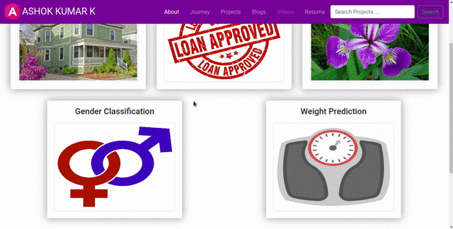

<h1 align="center">Gender Classification</h1>

## Table of contents
- [Demo](#demo)
- [Introduction](#introduction)
- [Motivation](#motivation)
- [Project Explanation](#project-explanation)
  - [Data Collection](#data-collection)
  - [Feature Engineering](#feature-engineering)
  - [Data Pre-processing](#data-pre-processing)
  - [Building Machine Learning Model](#building-machine-learning-model)
  - [Model Performance](#model-performance)
  - [Test Data Predictions](#test-data-predictions)
- [Conclusion](#conclusion)

## Demo

**App Link** : [Gender Classification](https://ashok-machine-learning-project.herokuapp.com/#gender)

