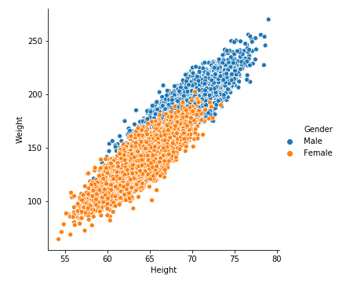
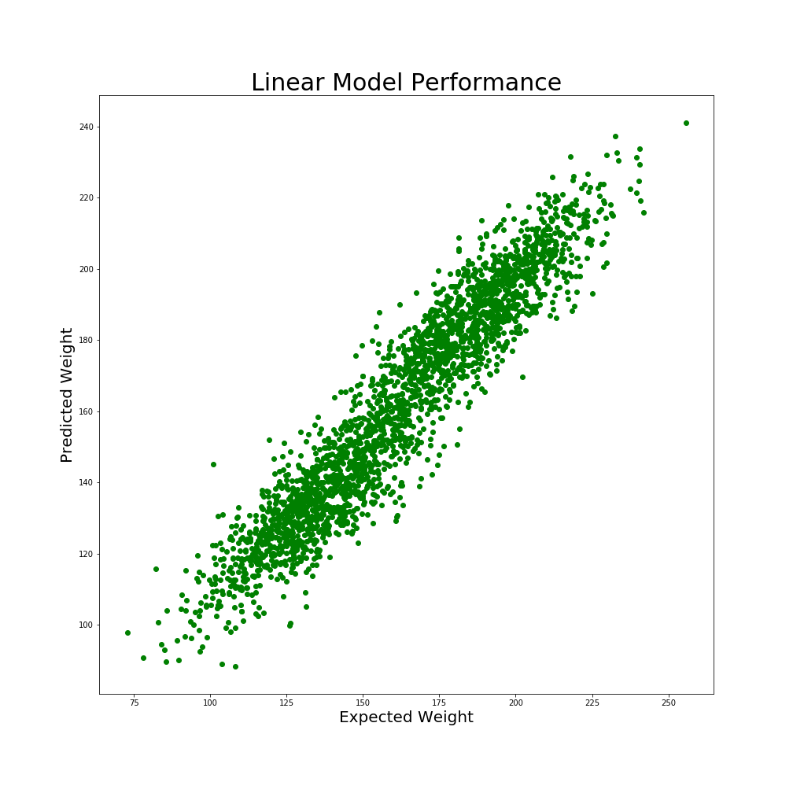

<h1 align="center">Weight Prediction</h1>

## Table of contents
- [Demo](#demo)
- [Introduction](#introduction)
- [Motivation](#motivation)
- [Project Explanation](#project-explanation)
  - [Data Collection](#data-collection)
  - [Feature Engineering](#feature-engineering)
  - [Data Pre-processing](#data-pre-processing)
  - [Feature Observations](#feature-observations)
  - [Building Machine Learning Model](#building-machine-learning-model)
  - [Model Performance](#model-performance)
- [Conclusion](#conclusion)

## Demo

**App Link** : [Weight prediction](https://ashok-machine-learning-project.herokuapp.com/#weight)


## Introduction
- This dataset consists of three columns which is Height, Weight and Gender.
- In this project we are going to predict person's weight based on gender and weight.
- Our goal is to train a model with the given data to predict weight.
- Let's look more into the data

<div align="center"></div>

## Motivation
- This is my first end to end data science project.
- I have done this project to stay motivated on Data Science.
- In this project, I have learnt about regression kind of problems.
- I done this project to learn, how the regression works.

## Project Explanation
### Data Collection
- The dataset is collected from [kaggle](https://www.kaggle.com/mustafaali96/weight-height).
- The dataset consists of a CSV file name `weight-height.csv`.
Let's load the collected data.

```python
# Loading Dataset
wh = pd.read_csv('../data/weight-height.csv')
```
- The dataset consists of 3 features i.e., Height, Weight and Gender.
- The dataset consists of 10,000 samples of different persons.

### Feature Engineering

**1. Height**

- The heights are mentioned in inches.
- There are no null values in the Height column.
- Let's see the distribution of height data.


- Here we get a well distributed data and a bell shaped curve shows that it is apt for analysis.

**2. Weight**

- The weights are mentioned in pounds.
- There are no null values in the Weight column.
- Let's see the distribution of weight data.


- Here we get a well distributed data and a bell shaped curve shows that it is apt for analysis.

**3. Gender**

- Gender is a **nominal** kind of **qualitative data**, because there is no numerical relation between different genders.
- Let's see the relation of Gender with height and weight.

 

### Data pre processing
The data which we collect from kaggle is already well pre-processed. So no need of pre-processing.

### Feature Observations
Let's see the correlation of features with a heatmap.




### Building Machine Learning Model

```python
wh['Gender'] = wh['Gender'].apply(lambda x : {'Male' : 1, 'Female' : 0}[x])


X = wh.loc[:, ['Height', 'Gender']].values
y = wh.loc[:, 'Weight'].values

from sklearn.model_selection import train_test_split
X_train, X_test, y_train, y_test = train_test_split(X, y, test_size = 0.25, random_state = 42)

from sklearn.linear_model import LinearRegression
from sklearn.pipeline import make_pipeline
from sklearn.preprocessing import StandardScaler

model = make_pipeline(StandardScaler(), LinearRegression())
model.fit(X_train, y_train)
```

```python
# Let's see the training and testing accuracy
print("Training Score : ", model.score(X_train, y_train) * 100)
print("Training Score : ", model.score(X_test, y_test) * 100)

OUTPUT :
Training Score :  90.28 %
Testing  Score :  90.27 %
```

### Model Performance

```python
plt.figure(figsize=(14, 14))
plt.scatter(y_test, model.predict(X_test), color = 'green')
plt.title('Linear Model Performance', fontsize = 30)
plt.xlabel('Expected Weight', fontsize = 20)
plt.ylabel('Predicted Weight', fontsize = 20)
plt.savefig('../images/modelperformance.png')
plt.show()
```



## Conclusion
- Finally we finished our weight prediction project.
- We have built a Linear Regression Model which performs well with given features and having the Training accuracy of 91.47% and Testing accuracy of 91.90%.

##### If you love my work, kindly give a Star to my repository.
##### Facing any issues, feel free to post your issues on my GitHub.
##### Thank you Everyone for seeing my work.
