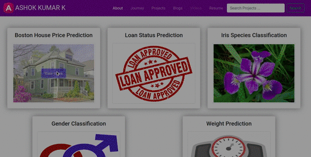
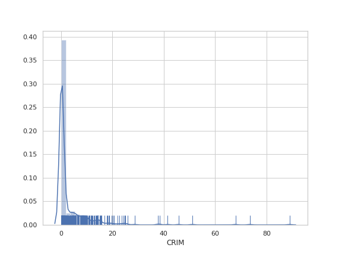
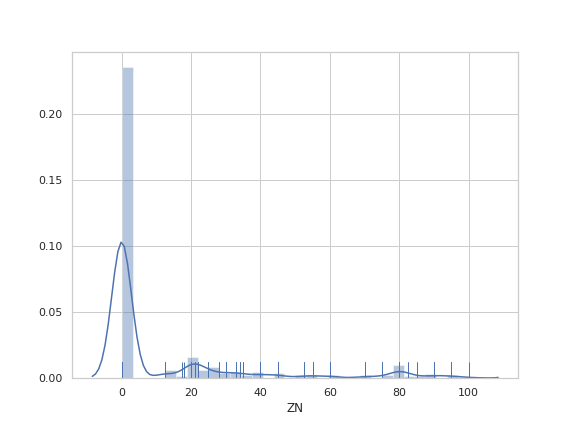
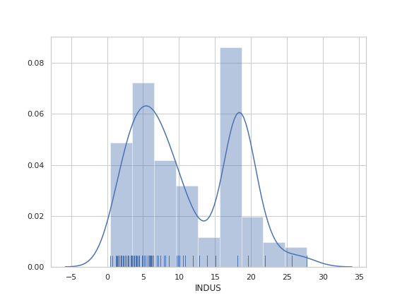
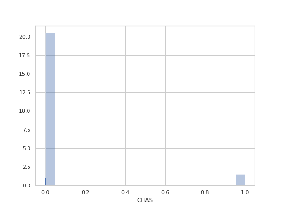
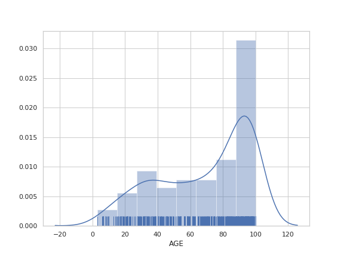
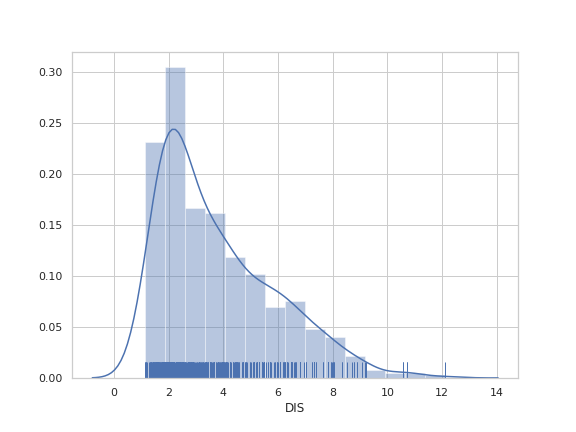
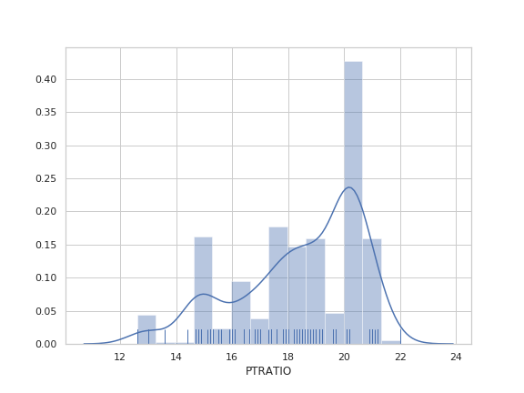
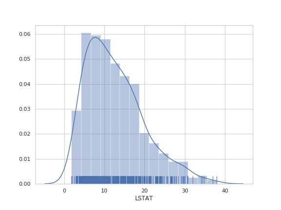
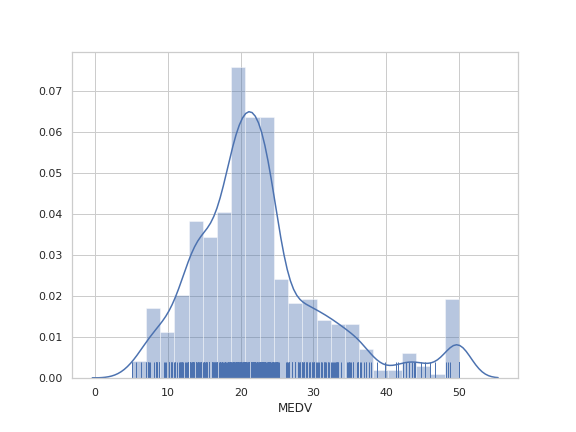

<h1 align="center">BOSTON HOUSING PRICE PREDICTION</h1>

# Table of Contents
- [Demo](#demo)
- [Introduction](#introduction)
  - [About the Dataset](#about-the-dataset)
  - [Dataset Naming](#dataset-naming)
  - [Miscellaneous Details](#miscellaneous-details)
    - [Origin](#origin)
    - [Usage](#usage)
    - [Number of Cases](#number-of-cases)
    - [Variables](#variables)
- [Motivation](#motivation)
- [Project Explanation](#project-explanation)
  - [Data Collection](#data-collection)
  - [Feature Engineering](#feature-engineering)
  - [Feature Observations](#feature-observations)
  - [Feature Selection](#feature-selection)
  - [Building Machine Learning Models](#building-machine-learning-models)
  - [Model Performances](#model-performances)
  - [Building Optimum Model](#building-optimum-model)
- [Conclusion](#conclusion)

## Demo
**App Link** - [Boston House Price Predictor](https://ashok-machine-learning-project.herokuapp.com/#boston)



## Introduction
### About the Dataset
This dataset contains information collected by the U.S Census Service concerning housing in the area of Boston Mass. It was obtained from the StatLib archive [Data](http://lib.stat.cmu.edu/datasets/boston), and has been used extensively throughout the literature to benchmark algorithms. However, these comparisons were primarily done outside of Delve and are thus somewhat suspect. The dataset is small in size with only 506 cases.

The data was originally published by Harrison, D. and Rubinfeld, D.L. `Hedonic prices and the demand for clean air', J. Environ. Economics & Management, vol.5, 81-102, 1978`.

### Dataset Naming
The name for this dataset is simply boston. It has two prototasks: nox, in which the nitrous oxide level is to be predicted; and price, in which the median value of a home is to be predicted.

### Miscellaneous Details
#### Origin
- The origin of the boston housing data is Natural.
#### Usage
- This dataset may be used for Assessment.
#### Number of Cases
- The dataset contains a total of 506 cases.
#### Order
- The order of the cases is mysterious.
#### Variables
There are 14 attributes in each case of the dataset. They are:
```bash
1. CRIM             - per capita crime rate by town
2. ZN               - proportion of residential land zoned for lots over 25,000 sq.ft.
3. INDUS            - proportion of non-retail business acres per town.
4. CHAS             - Charles River dummy variable (1 if tract bounds river; 0 otherwise)
5. NOX              - nitric oxides concentration (parts per 10 million)
6. RM               - average number of rooms per dwelling
7. AGE              - proportion of owner-occupied units built prior to 1940
8. DIS              - weighted distances to five Boston employment centres
9. RAD              - index of accessibility to radial highways
10. TAX             - full-value property-tax rate per 10,000 dollars.
11. PTRATIO         - pupil-teacher ratio by town
12. B               - 1000(Bk - 0.63)^2 where Bk is the proportion of blacks by town
13. LSTAT           - % lower status of the population
14. MEDV            - Median value of owner-occupied homes in 1000's dollars
```
- **Note**
    - Variable #14 seems to be censored at 50.00 (corresponding to a median price of 50,000 dollars); Censoring is suggested by the fact that the highest median price of exactly 50,000 dollars is reported in 16 cases, while 15 cases have prices between 40,000 dollars and 50,000 dollars, with prices rounded to the nearest hundred. Harrison and Rubinfeld do not mention any censoring.
    
## Motivation
- This project was started as a motivation for learning Machine Learning Algorithms and to learn the different data preprocessing techniques such as Exploratory Data Analysis, Feature Engineering, Feature Selection, Feature Scaling and finally to build a machine learning model.

- In this project we will predicts house price in boston city.

## Project Explanation
### Data Collection
- It was obtained from the StatLib archive [Data](http://lib.stat.cmu.edu/datasets/boston), and has been used extensively throughout the literature to benchmark algorithms. However, these comparisons were primarily done outside of Delve and are thus somewhat suspect. The dataset is small in size with only 506 cases.
- The dataset is collected from [Kaggle](https://www.kaggle.com/vikrishnan/boston-house-prices).

##### Loading the collected data
- The CSV data is loaded with the help of [read_csv](https://pandas.pydata.org/pandas-docs/stable/reference/api/pandas.read_csv.html) method in pandas library.
- The dataset consists of 506 samples and 14 features with 1 prediction feature.

```python
# Initializing column names
columns = ['CRIM', 'ZN', 'INDUS', 'CHAS', 'NOX', 'RM', 'AGE', 'DIS', 'RAD', 'TAX', 'PTRATIO', 'B', 'LSTAT', 'MEDV']

# Loading Boston Housing Dataset
boston = pd.read_csv('../data/housing.csv', delimiter=r"\s+", names = columns)
```

Let's see the  number of samples and factors
```python
# TODO : Let's know how many factors of an individual and Number of Samples
print("The Boston housing Price Prediction Dataset has")
print("\t\tNumber of Factors : \t", boston.shape[1] - 1)
print("\t\tNumber of Samples : \t", boston.shape[0])

OUTPUT :
The Boston housing Price Prediction Dataset has
		Number of Factors : 	 13
		Number of Samples : 	 506
```
### Feature Engineering
Let's check for null values.
```python
# TODO : Check for null values and visualizing it using heatmap
boston.isnull().sum()
OUTPUT : 
CRIM       0
ZN         0
INDUS      0
CHAS       0
NOX        0
RM         0
AGE        0
DIS        0
RAD        0
TAX        0
PTRATIO    0
B          0
LSTAT      0
MEDV       0
dtype: int64
```
###### Wowwww!!!! There are no null values in any of the features.

Let's check for Datatypes of each features.
```python
# TODO : Let's check for data types of all the columns
boston.dtypes

OUTPUT :

CRIM       float64
ZN         float64
INDUS      float64
CHAS         int64
NOX        float64
RM         float64
AGE        float64
DIS        float64
RAD          int64
TAX        float64
PTRATIO    float64
B          float64
LSTAT      float64
MEDV       float64
dtype: object
```
Though all the features are numerical values, we are going to see the distribution of data and some are categorical also.

<div align="center"></div>

### Feature Observations
Let's see the relation between each and every features


Let's see the correlation between the features.


Let's see the correlation with prediction column


### Feature Selection
```python
# Let's see the features having more correlation
corr_with_medv[:-1].abs().sort_values(ascending = False)
```

```bash
LSTAT      0.737663
RM         0.695360
PTRATIO    0.507787
INDUS      0.483725
TAX        0.468536
NOX        0.427321
CRIM       0.388305
RAD        0.381626
AGE        0.376955
ZN         0.360445
B          0.333461
DIS        0.249929
CHAS       0.175260
dtype: float64
```
###### Let's confirm this by using ExtraTreesRegressor

```python
# TODO : To know the feature Importances
y = boston['MEDV'].values
from sklearn.ensemble import ExtraTreesRegressor
etc = ExtraTreesRegressor()
etc.fit(boston.iloc[:, :-1].values, y)

print("Percentage Importance of each features with respect to House Price : ")
important_features = pd.Series(etc.feature_importances_*100, index = boston.columns[:-1])

# Feature Impotances by ExtraTressRegressor
important_features.sort_values(ascending = False)
```

```bash
OUTPUT :
LSTAT      35.155692
RM         33.497965
PTRATIO     5.909181
NOX         3.974996
INDUS       3.911079
TAX         3.886847
DIS         2.984446
CRIM        2.923965
RAD         1.990202
B           1.938884
AGE         1.820047
CHAS        1.599084
ZN          0.407612
dtype: float64
```

Approximately both correlation matrix and ExtraTreesRegressor says the same result.

Lets's plot the feaure importances with Matplotlib.


From the above feature observations and importances, we found that some columns are most important such as *LSTAT*, *RM*, *PTRATIO*, *NOX*, *INDUS* and *TAX*.

Let's arrange the features based on feature importance.
```python
# Arranging columns based on features importance
new_boston = boston[features_arranged_on_importance]
```

### Building Machine Learning Models

```
# Getting boston values
X = new_boston.values
X = X[:, :6]

# TODO : Splitting data as train and test data
from sklearn.model_selection import train_test_split
X_train, X_test, y_train, y_test = train_test_split(X, y, test_size = 0.20, random_state = 42)
```
##### Linear Regression
```python
from sklearn.linear_model import LinearRegression

linear_model = LinearRegression()
linear_model.fit(X_train, y_train)

print('Training Score : ', linear_model.score(X_train, y_train))
print('Testing Score  : ', linear_model.score(X_test, y_test))

print('R2 Score : ', r2_score(y_test, linear_model.predict(X_test)))
print('MSE : ', mean_squared_error(y_test, linear_model.predict(X_test)))
```

```bash
Training Score :  0.6906984575653774
Testing Score  :  0.6209548378098407
R2 Score       :  0.6209548378098407
MSE            :  27.796815732022583
```

##### Decision Tree Regression
Let's see how the different decision tree train for the given data.


See how the decision tree score changes for different random states

```python
X_train, X_test, y_train, y_test = train_test_split(X, y, test_size = 0.20, random_state = 42)

dtr_model = DecisionTreeRegressor(max_depth=23, random_state=3)
dtr_model.fit(X_train[:, :], y_train)

print('Training Score : ', dtr_model.score(X_train, y_train))
print('Testing Score  : ', dtr_model.score(X_test, y_test))
print('R2 Score       : ', r2_score(y_test, dtr_model.predict(X_test)))
print('MSE            : ', mean_squared_error(y_test, dtr_model.predict(X_test)))
```

```bash
Training Score :  1.0
Testing Score  :  0.8815969829691199
R2 Score       :  0.8815969829691199
MSE            :  8.682941176470589
```

##### Random Forest Regression
```python
from sklearn.ensemble import RandomForestRegressor
X_train, X_test, y_train, y_test = train_test_split(X, y, test_size = 0.20, random_state = 42)
rfr = RandomForestRegressor(max_depth = 7, random_state = 63)
rfr.fit(X_train, y_train)

print('Training Score : ', rfr.score(X_train, y_train))
print('Testing Score  : ', rfr.score(X_test, y_test))
print('R2 Score       : ', r2_score(y_test, rfr.predict(X_test)))
print('MSE            : ', mean_squared_error(y_test, rfr.predict(X_test)))
```

```bash
Training Score :  0.9560507818314905
Testing Score  :  0.8584494627144632
R2 Score       :  0.8584494627144632
MSE            :  10.380436407524767
```

##### Model accuracy of different models
```bash
Linear Regression : 
Score :  0.6209548378098407

Decision Tree Regression : 
Score :  0.8815969829691199

Random Forest Regression : 
Score :  0.8584494627144632

k Neighbors Regression : 
Score :  0.6094868472810563
```

### Model Performances
```python
X_train, X_test, y_train, y_test = train_test_split(X[:, :], y, test_size = 0.20, random_state = 46)

print('Random Forest Regression : ')
random_forest_regressor = RandomForestRegressor(max_depth = 7, random_state = 63)
random_forest_regressor.fit(X_train, y_train)
print('Score : ', random_forest_regressor.score(X, y))
```

```bash
OUTPUT :
Random Forest Regression : 
Score :  0.944479365914758
```

Let's see the score of Random forest model for different training samples.


Let's see the score of different Random forest model.


Let's see the score of Random forest model for different max_depths.


From this, we are going to choose,
- random_state = 3, for choosing random Training samples
- random_state = 68, for random Random forest regressor
- max_depth = 13, for Max Depths in random forest regressor

### Building Optimum Model

```python 
# Choosing Optimal Training Samples
X_train, X_test, y_train, y_test = train_test_split(X, y, test_size = 0.20, random_state = 3)

# Building Optimal Random Forest regressor Model
random_forest_regressor = RandomForestRegressor(max_depth = 13, random_state = 68)
random_forest_regressor.fit(X_train, y_train)
```

```python
RandomForestRegressor(bootstrap=True, ccp_alpha=0.0, criterion='mse',
                      max_depth=13, max_features='auto', max_leaf_nodes=None,
                      max_samples=None, min_impurity_decrease=0.0,
                      min_impurity_split=None, min_samples_leaf=1,
                      min_samples_split=2, min_weight_fraction_leaf=0.0,
                      n_estimators=100, n_jobs=None, oob_score=False,
                      random_state=68, verbose=0, warm_start=False)
```

```python
print('Training Accuracy        : ', random_forest_regressor.score(X_train, y_train))
print('Testing Accuracy         : ', random_forest_regressor.score(X_test, y_test))
print('Mean Squared Error       : ', mean_squared_error(y_test, random_forest_regressor.predict(X_test)))
print('Root Mean Squared Error  : ', mean_squared_error(y_test, random_forest_regressor.predict(X_test))**0.5)
print('Score                    : ', r2_score(y, random_forest_regressor.predict(X)))

OUTPUT :

Training Accuracy        :  0.9789853943215869
Testing Accuracy         :  0.9202169918339218
Mean Squared Error       :  6.602427120371769
Root Mean Squared Error  :  2.569518849974012
Score                    :  0.9673793783596027
```

## Conclusion
##### Finally we finishes the project. We have built a Random Forest Regressor Model which performs well with top 6 features and having the Training accuracy of 97.89% and Testing accuracy of 96.73%.

##### Thank you Everyone for reading my notebook.

##### If you love my work, kindly give a Star to my repository.
##### Facing any issues, feel free to post your issues on my GitHub.
