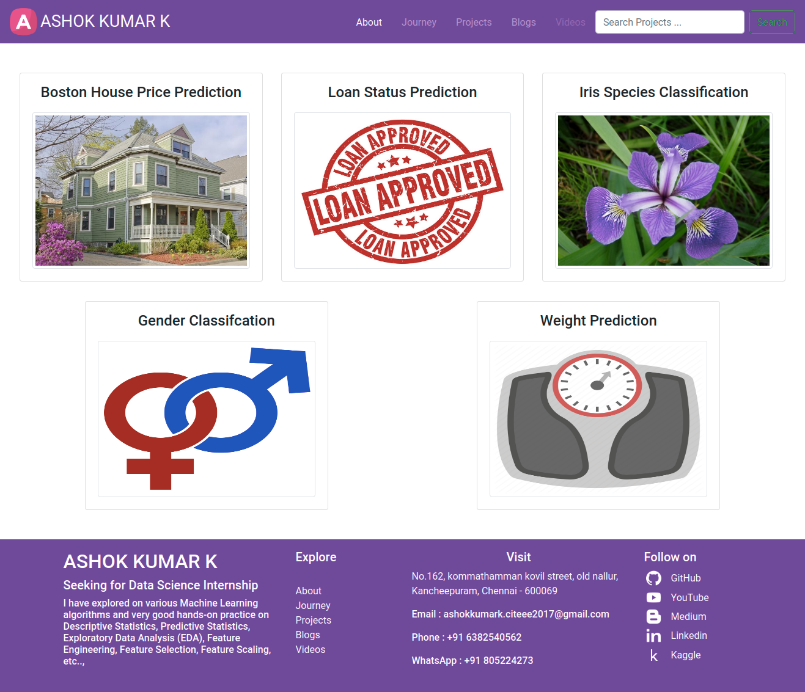
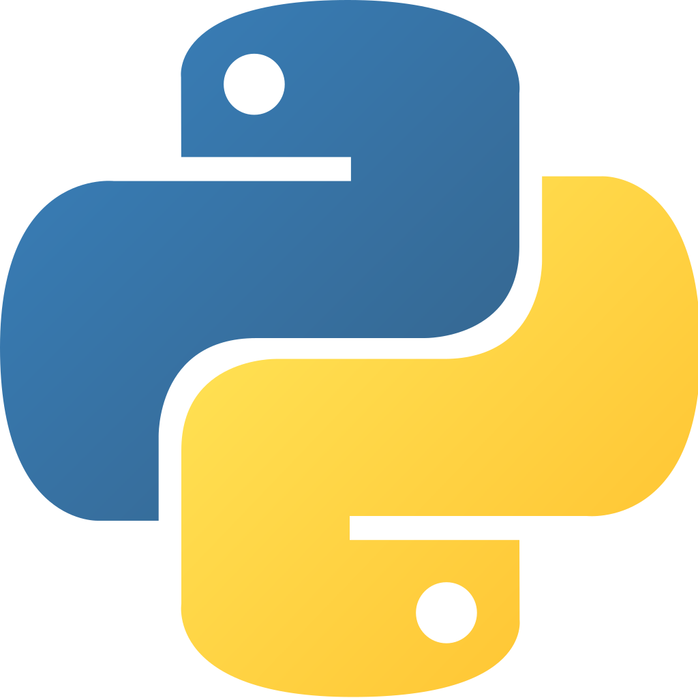
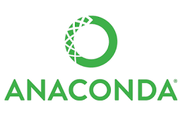
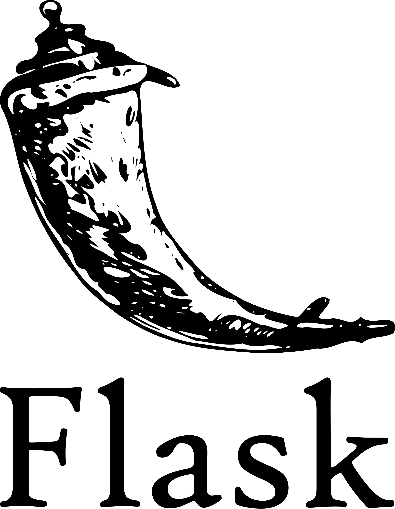
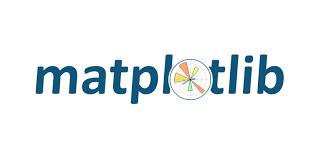
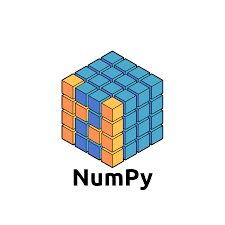

<h1 align="center">Machine Learning Projects</h1>

## Table of Contents
- [Demo](#demo)
- [Overview](#overview)
- [Motivation](#motivation)
- [Technical Aspects](#technical-aspects)
- [Installation](#installation)
- [Run](#run)
- [Deployment on Heroku](#deployment-on-heroku)
- [Directory Tree](#directory-tree)
- [To Do](#to-do)
- [Bug / Feature Request](#bug--feature-request)
- [Technologies Used](#technologies-used)
- [Team](#team)
- [License](#license)
- [Credits](#credits)

## Demo
- App Link : [ashok-machine-learning-projects](https://ashok-machine-learning-project.herokuapp.com/)

## Overview
In this repository, you can find all the Machine Learning projects which was done by me and deployed on Heroku platform. This app was built with Flask framework

## Motivation
Since I want to utilize this lockdown period usefully, I have done some projects based on Machine Learning Algorithms which makes me learning new concepts and techniques and so improving my knowledge day by day.

## Technical Aspects

## Installation

## Run

## Deployment on Heroku

## Directory Tree

## To Do

## Bug / Feature Request

## Technologies Used

## Team

<h5>ASHOK KUMAR K</h5>

## License
   Copyright 2020 ASHOK KUMAR K

   Licensed under the Apache License, Version 2.0 (the "License");
   you may not use this file except in compliance with the License.
   You may obtain a copy of the License at

       http://www.apache.org/licenses/LICENSE-2.0

   Unless required by applicable law or agreed to in writing, software
   distributed under the License is distributed on an "AS IS" BASIS,
   WITHOUT WARRANTIES OR CONDITIONS OF ANY KIND, either express or implied.
   See the License for the specific language governing permissions and
   limitations under the License.

## Credits
1. Kaggle - I have collected dataset from kaggle for some of the projects such as Loan Status Prediction, Iris Species Classification, Boston House Price Prediction, etc..,
