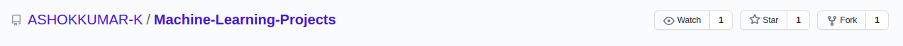

<h1 align="center">Machine Learning Projects</h1>

## Table of Contents
- [Demo](#demo)
- [Overview](#overview)
- [Motivation](#motivation)
- [Technical Aspects](#technical-aspects)
- [Installation](#installation)
- [Run](#run)
- [Deployment on Heroku](#deployment-on-heroku)
- [Directory Tree](#directory-tree)
- [To Do](#to-do)
- [Bug / Feature Request](#bug--feature-request)
- [Technologies Used](#technologies-used)
- [Team](#team)
- [License](#license)
- [Credits](#credits)

## Demo
- App Link : [ashok-machine-learning-projects](https://ashok-machine-learning-project.herokuapp.com/)

[](https://ashok-machine-learning-project.herokuapp.com/)

## Overview
This [repository](https://github.com/ASHOKKUMAR-K/Machine-Learning-Projects) consists of various machine learning projects in which each projects was done as end to end projects which means from Data Collection through feature engineering, feature selecion to Deployment and Maintainance. The whole app was built with Flask framework. You can launch my app by clicking [here](https://ashok-machine-learning-project.herokuapp.com/).

For building machine learning models, I have used scikit-learn alias sklearn.

The model was deployed on Heroku platform which is a platform-as-a-service.

## Motivation
While most of the students like me spending their precious time on PUBG, I decided to spend my precious time on learning to gear up my knowledge and my life. During this lockdown period I have learnt countless things related to Data Science and Machine Learning such as Data Preprocesing, Exploratory Data Analysis using NumPy and Pandas, Feature Engineering, Feature Selection, Feature Scaling, Visualization Techniques using Matplotlib and Seaborn and various Machine Learning Algorithms from scratch along with Hyper Parameter Tuning. But now I want to do some projects to help the society with my knowledge. So I have started with some beginner level projects to learn some more data related concepts and techniques and step on to some advanced level projects while progressing.

I always love to share my knowledge with my friends and helps on solving their coding related problems with my best and they also help me on learning new things and keeps motivating me. Though it is a small range of community, I want to expand my knowledge further. Whenever I wants relaxatiion, I write blogs to stay relevant. You can see all my blogs by clicking [here](https://medium.com/@Ashok_kumar_K).

## Technical Aspects
Since we can deploy only 5 app in Heroku as a free service, I came up with a new idea of deploying all my projects in a single web app and controlling the each projects navigation with Flask and Python.

Some extra-ordinary features that I have included in my app :
- Visualizing Probability of classifcation in each classification type problems.
- Added all the details about the projects such as data source, code source, libraries and frameworks used in each project's description.
- All my end to end projects in a single view.

## Installation
To run my app on your local machine, do the following steps.
- **Step 1** : 
   - I have written the Code with Python 3.7.7. If you don't have Python installed you can find it [here](https://www.python.org/downloads/release/python-377/).
   - If you are using a lower version of Python you can upgrade using the pip package, kindly ensure that you have the latest version of pip.
- **Step 2** :
   - If you want the current version of my repository to be in your github, you can do forking my repository by clicking as shown in the picture below.
<div align="center"></div>
   - Clone my repository to your local machine by running the following command. Before doing this, you have to install git on your machine and make sure you are having proper internet connection.
      - For **Windows OS** user, open *git bash* and run the following command `git clone `
      - For **Linus OS** user, open *Terminal* and run the following command `git clone `
   - If you don't want to mess up with all these things, you can just download the *zip* file of my GitHub repository and extract it to any file location as your wish and then use it.
   - Now we have done with the downloading of my whole code.
- **Step 3** :
   - After downloading the whole repo, get into the main folder by running the following command in git bash for Windows OS users and Terminal for Linux OS users `cd Machine-Learning-Projects` and click enter.
- **Step 4** :
   - Now we are going to install all the dependency libraries for this project. Before that you must have Python 3.7.7 and latest version of pip.
   - To install all the dependency libraries in a single command, run the following command.
   
   `pip install -r requirements.txt`
   
- **Step 5** :
   - After installing all the dependency libraries, you are ready to run my app on your local machine.
   - To launch my app on your local machine, hit the following command. `python ml_projects.py`

## Run
- Now you have successfully launched my app on your local machine.
- To view my app, hit the following URL in any of the browser such as Chrome, FireFox, etc..,
   
   `http://127.0.0.1:3000/`

## Deployment on Heroku
- After successfully running my app on your local machine, you also deploy my app on heroku by following the steps given on [Heroku Documentation](https://devcenter.heroku.com/articles/getting-started-with-python). You have to do it on your risk.
- In case, if you have any issues on deploying the app, please open a new issue by clicking [here](https://github.com/ASHOKKUMAR-K/Machine-Learning-Projects/issues/new/choose). Because it may help others while deploying.

## Directory Tree


```bash
Machine-Learning-Projects
├── 01.Iris_Species_Classification
├── 02.Loan_Status_Prediction
├── 03.Gender_Classifcation
├── 04.Weight_Prediction
├── 05.Boston_House_Price_Prediction
├── data
│   ├── ML_Projects.csv
│   └── social-media-links.csv
├── Demos
├── models
├── py_modules
│   ├── __pycache__
│   └── data_extraction.py
├── static
│   ├── css
│   ├── files
│   ├── images
│   └── js
├── templates
│   ├── base.html
│   ├── all_projects.html
│   ├── weight_predictor.html
│   ├── gender_classifier.html
│   ├── iris_species_classifier.html
│   ├── loan_status_predictor.html
│   └── boston_house_price_predictor.html
├── LICENSE.txt
├── ml_projects.py
├── Procfile
├── requirements.txt
├── runtime.txt
└── README.md
```


## To Do

These features will be added in the future
1. Connecting my portfolio app with this proect app very soon.
2. Using Exception handling for handling invalid input.
2. Adding a link to the data source in the project description popup modal.
3. Adding GitHub link to each projects in both description popup modal and project page.
4. Adding better visualization charts for classification type problems.
5. Adding visualization for regrerssion type problems.

## Bug / Feature Request

If you find a bug (the website couldn't handle the query and / or gave undesired results), kindly open an issue [here](https://github.com/ASHOKKUMAR-K/Machine-Learning-Projects/issues/new) by including your search query and the expected result.

If you'd like to request a new function, feel free to do so by opening an issue [here](https://github.com/ASHOKKUMAR-K/Machine-Learning-Projects/issues/new/choose). Please include sample queries and their corresponding results.

## Technologies Used

<a href="https://www.python.org/doc/"></a><a href="https://www.anaconda.com/"></a><a href="https://flask.palletsprojects.com/"></a><a href="https://matplotlib.org/3.2.2/contents.html"></a>
<a href="https://seaborn.pydata.org/"></a><a href="https://scikit-learn.org/"></a><a href="https://pandas.pydata.org/docs/"></a><a href="https://numpy.org/doc/"></a><a href="https://gunicorn.org/"></a>


## Team

<a href="https://ashok-machine-learning-project.herokuapp.com/"></a>
<h5>ASHOK KUMAR K</h5>

## License
   Copyright 2020 ASHOK KUMAR K

   Licensed under the Apache License, Version 2.0 (the "License");
   you may not use this file except in compliance with the License.
   You may obtain a copy of the License at

       http://www.apache.org/licenses/LICENSE-2.0

   Unless required by applicable law or agreed to in writing, software
   distributed under the License is distributed on an "AS IS" BASIS,
   WITHOUT WARRANTIES OR CONDITIONS OF ANY KIND, either express or implied.
   See the License for the specific language governing permissions and
   limitations under the License.

## Credits
1. Kaggle - I have collected dataset from kaggle for some of the projects such as Loan Status Prediction, Iris Species Classification, Boston House Price Prediction, etc..,
