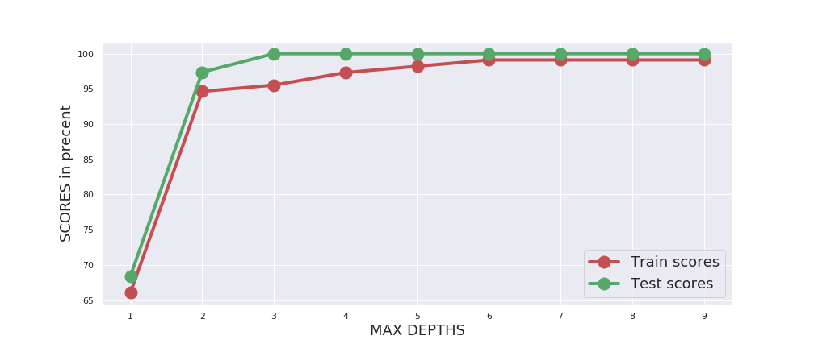

# Machine Learning Projects
This repository will consists of the machine learning projects which was done by me.

<h1>Iris Classification</h1>

- Want to know more about Iris Classification, click [here](https://medium.com/@Ashok_kumar_K/iris-species-classification-machine-learning-model-8d7fa4e48f81) to see my blog on medium.
- Want to explore my code, click [here](https://github.com/ASHOKKUMAR-K/Machine-Learning-Projects/tree/master/Iris) to have a look on my github.

  
#### You can see my upcoming projects on machine learning on the upcoming days.

#### If you love my work, give a star to my github [repository](https://github.com/ASHOKKUMAR-K/Machine-Learning-Projects).
Thank you.

